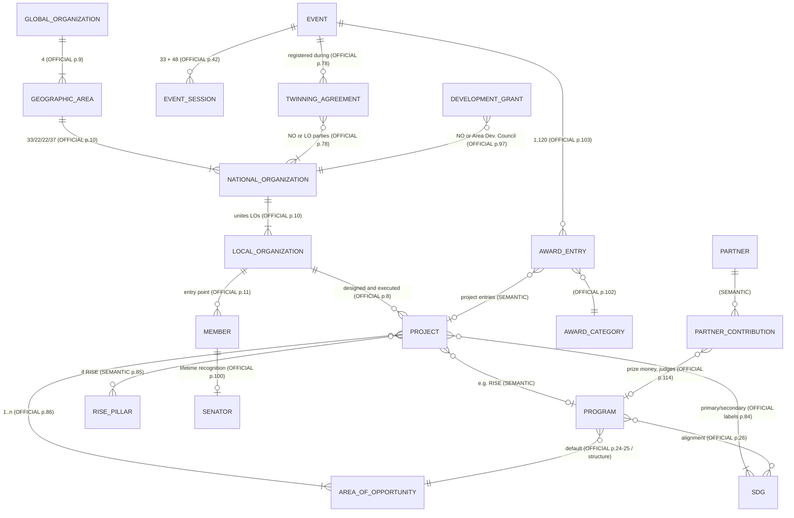

# JCI Impact Report 2025 — TIER 2
## F (Inventaire des indicateurs) · Modèle d'entités observé · G (Collecte locale) · H (Qualité & lignage)

> Suite directe de la **V2 Tier 1** (`JCI_Tier1_Reverse_Engineering_V2.md`). Mêmes règles, sans exception :
> **P0 — No unsupported inference becomes an official JCI fact.** Couches : **OFFICIAL_JCI_FACT** · **SEMANTIC_INTERPRETATION** · **PROPOSED_STANDARD** (+ extension à valider **LOCAL_REPORTED_FACT**). Statuts de valeur : `extracted` · `calculated` · `estimated` · `unknown` · `visual_data_not_extracted` · `conflicting`.
> Citations **[p. X — Section]** en folio imprimé. Références croisées : DQC-xx (conflits), VDX-xx (graphiques non lus), VDA-xx (associations interprétées).

## Synthèse Tier 2 (constats clés)

| # | Constat | Couche | Source |
|---|---|---|---|
| T2-1 | Le rapport contient **465 indicateurs atomiques** distincts (un chiffre, un libellé, un périmètre). **Seuls 3 ont une définition imprimée** : âge des membres, Alumni Club, Junior Club. Tous les autres sont `definition: unknown` | CONSTAT (couche texte vérifiée) | inventaire F |
| T2-2 | 100 indicateurs sont rattachés à un objet qualité (DQC, VDX ou VDA) | SEMANTIC_INTERPRETATION | F + registre V2 |
| T2-3 | **Toutes les sommes par geographic_area et par événement tombent juste** (18 contrôles : membres, LO, NO, clubs, CYE, JIB, formateurs, Public Speaking, inscriptions, twinning, prix, pétitions, activités IHD, débats, LEADER, site web). Les incohérences sont **entre pages**, pas à l'intérieur des tableaux | SEMANTIC_INTERPRETATION · calculated | F.4 |
| T2-4 | **Aucun chiffre agrégé n'est décomposable jusqu'au projet.** 42 401 bénévoles, 435 605 heures et 21 148 414 bénéficiaires n'ont ni ventilation par geographic_area, ni par pays, ni par LO. Le lignage global → projet est **cassé dans la source** | CONSTAT | H.3 |
| T2-5 | Le rapport laisse voir **les champs du formulaire JCI actuel** (nom du projet, LO, défi / contexte, ODD, heures, bénévoles, AoO multiples, pilier RISE, ODD principal / secondaire, année). Il ne décrit **aucune méthode de vérification** | SEMANTIC_INTERPRETATION (champs) / CONSTAT (vérification) | p. 84–90 |
| T2-6 | La seule liste de statuts de cycle de vie publiée concerne les **grants** : Application, In Process, Denied, Canceled, Pending Payment, Paid | OFFICIAL_JCI_FACT | [p. 97 — Development Grants] |

---

# F. INVENTAIRE COMPLET DES INDICATEURS

## F.1 Règles de construction

| Règle | Application |
|---|---|
| **Atomicité** | 1 ligne = 1 valeur × 1 libellé × 1 périmètre. Une ventilation « 4 Areas × (nombre + %) » donne 8 lignes, plus la ligne du total |
| **Aucune fusion** | Deux occurrences ne sont regroupées (champ `also_on_pages`) que si **libellé, valeur, unité et périmètre sont identiques**. Sinon : lignes séparées, liées par un DQC. Ex. : « Registrations » p. 59 et « Attendees » p. 61–70 ont les **mêmes nombres** mais restent **2 indicateurs** |
| **Nom normalisé unique** | `normalized_name` (PROPOSED_STANDARD `JCI-INDICATOR-v0`) est unique par indicateur. Le script d'inventaire refuse tout doublon. Paires volontairement distinctes : `output.beneficiaries.total` ≠ `venture.japjap.people_reached_outreach` ≠ `output.event_trainings.participants` ; `comm.facebook.reach` ≠ `comm.impressions.headline` ; `output.events.registrations.*` ≠ `output.events.attendees.*` |
| **Quantificateurs textuels** | « Hundreds », « Thousands », « Millions », « dozens », « Nearly half », « a small percentage » : stockés tels quels (`data_type: text`), **jamais convertis en nombre** (8 lignes) |
| **Cellules « - »** | Tableau des débats (p. 48) : `unknown`, **pas 0**. Les totaux de colonnes (37/10/10) sont cohérents avec « - » = 0, mais cette lecture reste une interprétation non adoptée |
| **Comptage d'une liste imprimée** | Ex. 5 panélistes, 4 langues, 6 ventures, 12 mentors, 18 mentions d'ODD : `calculated` (SEMANTIC_INTERPRETATION), pas OFFICIAL_JCI_FACT (6 lignes) |
| **Citations** | `quote_type` : `verbatim` (texte suivi), `table_cell_reconstructed` (libellé de ligne + cellule, mise en page aplatie), `chart_value_label_inferred` (VDA-01) |
| **Données tierces** | GITEX, World Chambers Congress, OHCHR, Sheltech : `geographic_level = external*`. Ce ne sont jamais des résultats JCI (DQC-21) |

## F.2 Sémantique des colonnes (couche de chaque colonne)

| Colonne demandée | Champ JSON | Couche |
|---|---|---|
| ID | `id` | PROPOSED_STANDARD (identifiant d'inventaire) |
| Exact label | `exact_label` | OFFICIAL_JCI_FACT (reformulé en suffixe « — share », « — {Area} » pour les cellules de tableau) |
| Normalized name | `normalized_name` | PROPOSED_STANDARD |
| Value | `value{value, value_qualifier, unit, value_status, source}` | OFFICIAL_JCI_FACT (`extracted`), ou SEMANTIC_INTERPRETATION (`calculated`), ou `null` (`unknown`, `visual_data_not_extracted`) |
| Unit / Data type | `unit`, `data_type` | SEMANTIC_INTERPRETATION (typage) |
| Definition | `definition` | OFFICIAL_JCI_FACT si imprimée, sinon `unknown` |
| Page / Section / Source | `page`, `also_on_pages`, `section`, `source.quote`, `source.quote_type` | OFFICIAL_JCI_FACT |
| Category | `category.iaooi_class` (+ `area_of_opportunity_chapter`) | Classe = code PROPOSED_STANDARD `IAOOI-v0`, attribué par SEMANTIC_INTERPRETATION ; chapitre = OFFICIAL_JCI_FACT (structure du document) |
| Geographic level | `geographic_level` + `geographic_scope` | SEMANTIC_INTERPRETATION |
| Confidence | `confidence` | SEMANTIC_INTERPRETATION (confiance dans la classification et le périmètre, pas dans la vérité du chiffre) |
| Status | `status`, `dq_refs` | `value_status` V2 + objets qualité |

`geographic_level` (PROPOSED_STANDARD) : `global_network` · `geographic_area` · `national_organization` · `local_organization` · `event` · `digital_channel` · `survey_sample` · `individual_member` · `individual_venture` · `external_event` · `external`.

## F.3 Répartition

**Par classe IAOOI-v0 (SEMANTIC_INTERPRETATION)**

| Classe | Nb |
|---|---|
| OUTPUT | 234 |
| CONTEXT | 124 |
| ACTIVITY | 37 |
| INPUT | 37 |
| UNCERTAIN | 20 |
| OUTCOME | 12 |
| IMPACT-CLAIM | 1 |

**Par statut de valeur**

| value_status | Nb |
|---|---|
| extracted | 445 |
| visual_data_not_extracted | 9 |
| calculated | 6 |
| unknown | 5 |

**Par niveau géographique (SEMANTIC_INTERPRETATION)**

| geographic_level | Nb |
|---|---|
| event | 117 |
| global_network | 86 |
| digital_channel | 79 |
| geographic_area | 79 |
| national_organization | 31 |
| local_organization | 30 |
| survey_sample | 16 |
| individual_member | 12 |
| individual_venture | 9 |
| external_event | 5 |
| external | 1 |

Lecture : **12 OUTCOME sur 465** (2,6 %), presque tous auto-déclarés ; **1 seul outcome mesuré par un instrument** (Ankara, >90 %) ; **0 IMPACT** (1 IMPACT-CLAIM). Un quart des indicateurs relèvent du CONTEXT (structure du réseau, sondage, dates).

## F.4 Contrôles arithmétiques internes (SEMANTIC_INTERPRETATION · calculated)

| Total publié | Somme des parties publiées | Résultat |
|---|---|---|
| Membres [p. 8] : 147 670 | 147 670 | ✔ égal |
| Local Organizations [p. 8] : 4 641 | 4 641 | ✔ égal |
| National Organizations [p. 10] : 114 | 114 | ✔ égal |
| Alumni Clubs [p. 12] : 366 | 366 | ✔ égal |
| Junior Clubs [p. 13] : 89 | 89 | ✔ égal |
| CYE (association VDA-01) [p. 28] : 108 | 108 | ✔ égal |
| JIB [p. 33–34] : 345 | 345 | ✔ égal |
| Formateurs certifiés [p. 41] : 97 | 97 | ✔ égal |
| Public Speaking [p. 43] : 52 | 52 | ✔ égal |
| Débats (équipes) [p. 48] : 57 | 57 | ✔ égal |
| Inscriptions événements [p. 59] : 10 729 | 10 729 | ✔ égal |
| Pétitions IHD [p. 73] : 67 101 | 67 101 | ✔ égal |
| Activités IHD [p. 73] : 42 | 42 | ✔ égal |
| Accords de Twinning [p. 78] : 113 | 113 | ✔ égal |
| Entrées aux prix [p. 103] : 1 120 | 1 120 | ✔ égal |
| LEADER — lecteurs [p. 20] : 13 872 | 13 872 | ✔ égal |
| LEADER — visites [p. 20] : 15 423 | 15 423 | ✔ égal |
| jci.cc — utilisateurs actifs par appareil [p. 22] : 13 351 | 13 351 | ✔ égal |

> Ces 18 contrôles valident la **cohérence interne des tableaux**. Ils ne valident **pas** les chiffres eux-mêmes, qui restent `reported` (cf. H).

## F.5 Inventaire (465 indicateurs)

> Version complète, avec définitions, citations, notes et chapitre AoO : `jci_indicator_inventory_v2.csv` (ouvrable dans Excel) et `jci_indicator_inventory_v2.json` (enveloppes de provenance, validées). Le tableau ci-dessous en est une vue compacte. Valeurs : ≥ = `at_least`, ≤ = `at_most`, ≈ = `approx`. Colonne Def. : ✔ = définition imprimée.

| ID | Exact label | Normalized name | Value | Unit | Type | Def. | Page | Category | Geo level · scope | Period | Conf. | Status | DQ |
|---|---|---|---|---|---|---|---|---|---|---|---|---|---|
| IND-001 | young leaders | `network.young_leaders.headline` | ≥ 100 000 | person | integer | — | v | CONTEXT | global_network · GLOBAL | NOT SPECIFIED | H | extracted | DQC-01 |
| IND-002 | countries | `network.countries.headline` | ≥ 100 | country | integer | — | v | CONTEXT | global_network · GLOBAL | NOT SPECIFIED | H | extracted | DQC-02 |
| IND-003 | projects implemented (2024–2025) | `activity.projects_implemented` | ≥ 1 000 | project | integer | — | v | ACTIVITY | global_network · GLOBAL | 2024–2025 | H | extracted | DQC-03 |
| IND-004 | beneficiaries reached worldwide | `output.beneficiaries_reached.headline` | ≥ 21 000 000 | person | integer | — | v | OUTPUT | global_network · GLOBAL | NOT SPECIFIED | M | extracted |  |
| IND-005 | volunteers engaged | `input.volunteers_engaged.headline` | ≥ 40 000 | person | integer | — | v | INPUT | global_network · GLOBAL | NOT SPECIFIED | H | extracted | DQC-05 |
| IND-006 | hours of service | `input.volunteer_hours.headline` | ≥ 435 000 | hour | integer | — | v | INPUT | global_network · GLOBAL | NOT SPECIFIED | H | extracted |  |
| IND-007 | Local Organizations mobilized across continents | `input.local_organizations_mobilized` | ≥ 4 500 | local_organization | integer | — | v | INPUT | global_network · GLOBAL | NOT SPECIFIED | M | extracted | DQC-04 |
| IND-008 | Projects addressing all 17 Sustainable Development Goals (SDGs) | `coverage.sdgs_addressed` | 17 | sdg | integer | — | v | UNCERTAIN | global_network · GLOBAL | NOT SPECIFIED | M | extracted |  |
| IND-009 | attendees participating in international events | `output.event_attendees.headline` | ≥ 10 000 | person | integer | — | v | OUTPUT | global_network · GLOBAL | NOT SPECIFIED | H | extracted | DQC-06 |
| IND-010 | participants trained through global and regional conferences | `output.people_trained.conferences` | 1 969 | person | integer | — | v (+42) | OUTPUT | event · Area Conferences + World Congress | NOT SPECIFIED | H | extracted |  |
| IND-011 | leadership training sessions | `activity.leadership_training_sessions` | 33 | session | integer | — | v (+42) | ACTIVITY | event · Area Conferences + World Congress | NOT SPECIFIED | H | extracted |  |
| IND-012 | skills development sessions | `activity.skills_development_sessions` | 48 | session | integer | — | v (+42) | ACTIVITY | event · Area Conferences + World Congress | NOT SPECIFIED | H | extracted |  |
| IND-013 | members trained through sustainable leadership and global citizenship courses | `output.members_trained.courses` | Hundreds | text_quantifier | text | — | v | OUTPUT | global_network · GLOBAL | NOT SPECIFIED | M | extracted |  |
| IND-014 | Initiatives implemented collaboratively across … National Organizations | `network.national_organizations.collaborative_initiatives` | 114 | national_organization | integer | — | v | UNCERTAIN | global_network · GLOBAL | NOT SPECIFIED | M | extracted |  |
| IND-015 | members engaged in cross-border exchanges and global initiatives | `output.members_cross_border` | Thousands | text_quantifier | text | — | v | OUTPUT | global_network · GLOBAL | NOT SPECIFIED | L | extracted |  |
| IND-016 | dollars mobilized in resources | `input.resources_mobilized` | Millions | text_quantifier | text | — | v | INPUT | global_network · GLOBAL | NOT SPECIFIED | L | extracted |  |
| IND-017 | followers across JCI's digital platforms | `comm.followers.all_platforms.headline` | ≥ 260 000 | follower | integer | — | v | OUTPUT | digital_channel · all platforms | NOT SPECIFIED | H | extracted | DQC-07 |
| IND-018 | impressions | `comm.impressions.headline` | ≥ 2 000 000 | impression | integer | — | v | OUTPUT | digital_channel · NOT SPECIFIED | NOT SPECIFIED | M | extracted | DQC-08 |
| IND-019 | The Leader Magazine: readers | `comm.leader.readers.headline` | ≈ 13 800 | reader | integer | — | v | OUTPUT | digital_channel · The LEADER Magazine | NOT SPECIFIED | H | extracted | DQC-09 |
| IND-020 | The Leader Magazine: countries | `comm.leader.countries` | ≥ 70 | country | integer | — | v | OUTPUT | digital_channel · The LEADER Magazine | NOT SPECIFIED | M | extracted | DQC-09 |
| IND-021 | JCI Senators | `network.senators.headline` | 84 375 | person | integer | — | v (+100) | CONTEXT | global_network · GLOBAL | NOT SPECIFIED | H | extracted |  |
| IND-022 | young leaders across four Areas | `network.young_leaders.president_message` | ≥ 100 000 | person | integer | — | vi | CONTEXT | global_network · GLOBAL | NOT SPECIFIED | H | extracted | DQC-01 |
| IND-023 | projects across more than 4,500 Local Organizations | `activity.projects.sg_message` | ≥ 10 000 | project | integer | — | vii | ACTIVITY | global_network · GLOBAL | NOT SPECIFIED | M | extracted | DQC-03 |
| IND-024 | Local Organizations (SG message) | `network.local_organizations.sg_message` | ≥ 4 500 | local_organization | integer | — | vii | CONTEXT | global_network · GLOBAL | NOT SPECIFIED | H | extracted | DQC-04 |
| IND-025 | age of members (lower bound) | `network.member_age.min` | 18 | year | integer | ✔ | 2 | CONTEXT | global_network · GLOBAL | NOT SPECIFIED | H | extracted |  |
| IND-026 | age of members (upper bound) | `network.member_age.max` | 40 | year | integer | — | 2 | CONTEXT | global_network · GLOBAL | NOT SPECIFIED | H | extracted |  |
| IND-027 | year founded | `network.founded_year` | 1 915 | year | date_year | — | 2 | CONTEXT | global_network · GLOBAL | NOT SPECIFIED | H | extracted |  |
| IND-028 | countries (overview) | `network.countries.overview` | ≥ 114 | country | integer | — | 2 | CONTEXT | global_network · GLOBAL | Today (as printed) | H | extracted | DQC-02 |
| IND-029 | members (overview) | `network.members.overview` | ≥ 147 000 | person | integer | — | 2 | CONTEXT | global_network · GLOBAL | Today (as printed) | H | extracted | DQC-01 |
| IND-030 | Local Organizations (overview) | `network.local_organizations.overview` | ≈ 4 600 | local_organization | integer | — | 2 | CONTEXT | global_network · GLOBAL | Today (as printed) | H | extracted | DQC-04 |
| IND-031 | partner of the United Nations since | `network.un_partner_since` | 1 954 | year | date_year | — | 2 | CONTEXT | global_network · GLOBAL | NOT SPECIFIED | H | extracted |  |
| IND-032 | survey respondents | `survey.respondents` | 3 767 | person | integer | — | 3 | CONTEXT | survey_sample · 2025 Membership Experience Survey | 2025 | H | extracted |  |
| IND-033 | average age of a JCI member | `survey.average_age` | 32 | year | decimal | — | 3 | CONTEXT | survey_sample · 2025 Membership Experience Survey | 2025 | H | extracted |  |
| IND-034 | average age — Africa & the Middle East | `survey.average_age.afme` | 29 | year | decimal | — | 3 | CONTEXT | survey_sample · AFME | 2025 | H | extracted |  |
| IND-035 | average age — Europe | `survey.average_age.europe` | 36 | year | decimal | — | 3 | CONTEXT | survey_sample · EUROPE | 2025 | H | extracted |  |
| IND-036 | members involved between 1–6 years | `survey.tenure_1_6_years` | Nearly half | text_quantifier | text | — | 3 | CONTEXT | survey_sample · 2025 Membership Experience Survey | 2025 | M | extracted |  |
| IND-037 | members active for more than 7 years | `survey.tenure_over_7_years` | ≥ 900 | person | integer | — | 3 | CONTEXT | survey_sample · 2025 Membership Experience Survey | 2025 | H | extracted |  |
| IND-038 | male respondents | `survey.gender.male` | 0.567 | ratio | percentage | — | 3 | CONTEXT | survey_sample · 2025 Membership Experience Survey | 2025 | H | extracted |  |
| IND-039 | female respondents | `survey.gender.female` | 0.43 | ratio | percentage | — | 3 | CONTEXT | survey_sample · 2025 Membership Experience Survey | 2025 | H | extracted |  |
| IND-040 | respondents identifying outside the binary | `survey.gender.other` | a small percentage | text_quantifier | text | — | 3 | CONTEXT | survey_sample · 2025 Membership Experience Survey | 2025 | M | extracted |  |
| IND-041 | employed full-time | `survey.employment.full_time` | 1 636 | person | integer | — | 3 | CONTEXT | survey_sample · 2025 Membership Experience Survey | 2025 | H | extracted |  |
| IND-042 | entrepreneurs/self-employed | `survey.employment.entrepreneur` | 1 166 | person | integer | — | 3 | CONTEXT | survey_sample · 2025 Membership Experience Survey | 2025 | H | extracted |  |
| IND-043 | completed undergraduate studies | `survey.education.undergraduate` | ≥ 1 450 | person | integer | — | 3 | CONTEXT | survey_sample · 2025 Membership Experience Survey | 2025 | H | extracted |  |
| IND-044 | holding a master's degree | `survey.education.masters` | ≤ 950 | person | integer | — | 3 | CONTEXT | survey_sample · 2025 Membership Experience Survey | 2025 | H | extracted |  |
| IND-045 | enrolled in master's programs | `survey.education.masters_enrolled` | 383 | person | integer | — | 3 | CONTEXT | survey_sample · 2025 Membership Experience Survey | 2025 | H | extracted |  |
| IND-046 | pursuing doctoral studies | `survey.education.doctoral` | 90 | person | integer | — | 3 | CONTEXT | survey_sample · 2025 Membership Experience Survey | 2025 | H | extracted |  |
| IND-047 | technical or vocational qualifications | `survey.education.vocational` | 160 | person | integer | — | 3 | CONTEXT | survey_sample · 2025 Membership Experience Survey | 2025 | H | extracted |  |
| IND-048 | members | `network.members.total` | 147 670 | person | integer | — | 8 (+9) | CONTEXT | global_network · GLOBAL | 2025 | H | extracted | DQC-01 |
| IND-049 | Total Members — Africa & Middle East | `network.members.afme` | 15 102 | person | integer | — | 8 (+9) | CONTEXT | geographic_area · AFME | 2025 | H | extracted |  |
| IND-050 | Total Members — Africa & Middle East — share | `network.members.afme.share` | 0.102 | ratio | percentage | — | 8 | CONTEXT | geographic_area · AFME | 2025 | H | extracted |  |
| IND-051 | Total Members — Asia & the Pacific | `network.members.aspac` | 103 170 | person | integer | — | 8 (+9) | CONTEXT | geographic_area · ASPAC | 2025 | H | extracted |  |
| IND-052 | Total Members — Asia & the Pacific — share | `network.members.aspac.share` | 0.699 | ratio | percentage | — | 8 | CONTEXT | geographic_area · ASPAC | 2025 | H | extracted |  |
| IND-053 | Total Members — America | `network.members.america` | 11 775 | person | integer | — | 8 (+9) | CONTEXT | geographic_area · AMERICA | 2025 | H | extracted |  |
| IND-054 | Total Members — America — share | `network.members.america.share` | 0.08 | ratio | percentage | — | 8 | CONTEXT | geographic_area · AMERICA | 2025 | H | extracted |  |
| IND-055 | Total Members — Europe | `network.members.europe` | 17 623 | person | integer | — | 8 (+9) | CONTEXT | geographic_area · EUROPE | 2025 | H | extracted |  |
| IND-056 | Total Members — Europe — share | `network.members.europe.share` | 0.119 | ratio | percentage | — | 8 | CONTEXT | geographic_area · EUROPE | 2025 | H | extracted |  |
| IND-057 | Number of Members (Area Wise) — America (chart) | `network.members.america.share.chart` | 0.8 | ratio | percentage | — | 8 | CONTEXT | geographic_area · AMERICA | 2025 | L | extracted | DQC-25 |
| IND-058 | Local Organizations | `network.local_organizations.total` | 4 641 | local_organization | integer | — | 8 (+11) | CONTEXT | global_network · GLOBAL | 2025 | H | extracted | DQC-04 |
| IND-059 | Local Organizations (LO) — Africa & Middle East | `network.local_organizations.afme` | 468 | local_organization | integer | — | 8 (+9, 11) | CONTEXT | geographic_area · AFME | 2025 | H | extracted |  |
| IND-060 | Local Organizations (LO) — Africa & Middle East — share | `network.local_organizations.afme.share` | 0.101 | ratio | percentage | — | 8 | CONTEXT | geographic_area · AFME | 2025 | H | extracted |  |
| IND-061 | Local Organizations (LO) — Asia & the Pacific | `network.local_organizations.aspac` | 2 945 | local_organization | integer | — | 8 (+9, 11) | CONTEXT | geographic_area · ASPAC | 2025 | H | extracted |  |
| IND-062 | Local Organizations (LO) — Asia & the Pacific — share | `network.local_organizations.aspac.share` | 0.635 | ratio | percentage | — | 8 | CONTEXT | geographic_area · ASPAC | 2025 | H | extracted |  |
| IND-063 | Local Organizations (LO) — America | `network.local_organizations.america` | 492 | local_organization | integer | — | 8 (+9, 11) | CONTEXT | geographic_area · AMERICA | 2025 | H | extracted |  |
| IND-064 | Local Organizations (LO) — America — share | `network.local_organizations.america.share` | 0.106 | ratio | percentage | — | 8 | CONTEXT | geographic_area · AMERICA | 2025 | H | extracted |  |
| IND-065 | Local Organizations (LO) — Europe | `network.local_organizations.europe` | 736 | local_organization | integer | — | 8 (+9, 11) | CONTEXT | geographic_area · EUROPE | 2025 | H | extracted |  |
| IND-066 | Local Organizations (LO) — Europe — share | `network.local_organizations.europe.share` | 0.158 | ratio | percentage | — | 8 | CONTEXT | geographic_area · EUROPE | 2025 | H | extracted |  |
| IND-067 | Number of Local Organizations (Area Wise) — Europe — share | `network.local_organizations.europe.share.p11` | 0.159 | ratio | percentage | — | 11 | CONTEXT | geographic_area · EUROPE | 2025 | H | extracted | DQC-19 |
| IND-068 | National Organizations | `network.national_organizations.total` | 114 | national_organization | integer | — | 8 (+10) | CONTEXT | global_network · GLOBAL | 2025 | H | extracted |  |
| IND-069 | Areas of the world | `network.geographic_areas.count` | 4 | geographic_area | integer | — | 8 | CONTEXT | global_network · GLOBAL | NOT SPECIFIED | H | extracted |  |
| IND-070 | Global Presence (Countries) | `network.countries.map` | 114 | country | integer | — | 9 | CONTEXT | global_network · GLOBAL | 2025 | H | extracted | DQC-02 |
| IND-071 | Global Presence — list of countries | `network.countries.list` | `null` | country_list | list | — | 9 | CONTEXT | global_network · GLOBAL | NOT SPECIFIED | H | visual_data_not_extracted | VDX-01 |
| IND-072 | Number of National Organizations (Area Wise) — Africa and the Middle East | `network.national_organizations.afme` | 33 | national_organization | integer | — | 10 | CONTEXT | geographic_area · AFME | 2025 | H | extracted |  |
| IND-073 | Number of National Organizations (Area Wise) — Africa and the Middle East — share | `network.national_organizations.afme.share` | 0.289 | ratio | percentage | — | 10 | CONTEXT | geographic_area · AFME | 2025 | H | extracted |  |
| IND-074 | Number of National Organizations (Area Wise) — Asia and the Pacific | `network.national_organizations.aspac` | 22 | national_organization | integer | — | 10 | CONTEXT | geographic_area · ASPAC | 2025 | H | extracted |  |
| IND-075 | Number of National Organizations (Area Wise) — Asia and the Pacific — share | `network.national_organizations.aspac.share` | 0.193 | ratio | percentage | — | 10 | CONTEXT | geographic_area · ASPAC | 2025 | H | extracted |  |
| IND-076 | Number of National Organizations (Area Wise) — America | `network.national_organizations.america` | 22 | national_organization | integer | — | 10 | CONTEXT | geographic_area · AMERICA | 2025 | H | extracted |  |
| IND-077 | Number of National Organizations (Area Wise) — America — share | `network.national_organizations.america.share` | 0.193 | ratio | percentage | — | 10 | CONTEXT | geographic_area · AMERICA | 2025 | H | extracted |  |
| IND-078 | Number of National Organizations (Area Wise) — Europe | `network.national_organizations.europe` | 37 | national_organization | integer | — | 10 | CONTEXT | geographic_area · EUROPE | 2025 | H | extracted |  |
| IND-079 | Number of National Organizations (Area Wise) — Europe — share | `network.national_organizations.europe.share` | 0.325 | ratio | percentage | — | 10 | CONTEXT | geographic_area · EUROPE | 2025 | H | extracted |  |
| IND-080 | Total Number of Alumni Clubs | `network.alumni_clubs.total` | 366 | club | integer | ✔ | 12 | CONTEXT | global_network · GLOBAL | NOT SPECIFIED | H | extracted |  |
| IND-081 | Number of JCI Alumni Clubs (Area Wise) — Asia and the Pacific | `network.alumni_clubs.aspac` | 175 | club | integer | — | 12 | CONTEXT | geographic_area · ASPAC | NOT SPECIFIED | H | extracted |  |
| IND-082 | Number of JCI Alumni Clubs (Area Wise) — Asia and the Pacific — share | `network.alumni_clubs.aspac.share` | 0.4781 | ratio | percentage | — | 12 | CONTEXT | geographic_area · ASPAC | NOT SPECIFIED | H | extracted |  |
| IND-083 | Number of JCI Alumni Clubs (Area Wise) — America | `network.alumni_clubs.america` | 4 | club | integer | — | 12 | CONTEXT | geographic_area · AMERICA | NOT SPECIFIED | H | extracted |  |
| IND-084 | Number of JCI Alumni Clubs (Area Wise) — America — share | `network.alumni_clubs.america.share` | 0.0109 | ratio | percentage | — | 12 | CONTEXT | geographic_area · AMERICA | NOT SPECIFIED | H | extracted |  |
| IND-085 | Number of JCI Alumni Clubs (Area Wise) — Africa and the Middle East | `network.alumni_clubs.afme` | 6 | club | integer | — | 12 | CONTEXT | geographic_area · AFME | NOT SPECIFIED | H | extracted |  |
| IND-086 | Number of JCI Alumni Clubs (Area Wise) — Africa and the Middle East — share | `network.alumni_clubs.afme.share` | 0.0164 | ratio | percentage | — | 12 | CONTEXT | geographic_area · AFME | NOT SPECIFIED | H | extracted |  |
| IND-087 | Number of JCI Alumni Clubs (Area Wise) — Europe | `network.alumni_clubs.europe` | 181 | club | integer | — | 12 | CONTEXT | geographic_area · EUROPE | NOT SPECIFIED | H | extracted |  |
| IND-088 | Number of JCI Alumni Clubs (Area Wise) — Europe — share | `network.alumni_clubs.europe.share` | 0.4945 | ratio | percentage | — | 12 | CONTEXT | geographic_area · EUROPE | NOT SPECIFIED | H | extracted |  |
| IND-089 | Total Number of Members (Alumni Clubs) | `network.alumni_clubs.members` | 1 343 | person | integer | — | 12 | CONTEXT | global_network · GLOBAL | NOT SPECIFIED | H | extracted |  |
| IND-090 | Total Countries Represented (Alumni Clubs) | `network.alumni_clubs.countries` | 18 | country | integer | — | 12 | CONTEXT | global_network · GLOBAL | NOT SPECIFIED | H | extracted |  |
| IND-091 | Total Number of Junior Clubs | `network.junior_clubs.total` | 89 | club | integer | ✔ | 13 | CONTEXT | global_network · GLOBAL | NOT SPECIFIED | H | extracted |  |
| IND-092 | Number of JCI Junior Clubs (Area Wise) — Asia and the Pacific | `network.junior_clubs.aspac` | 60 | club | integer | — | 13 | CONTEXT | geographic_area · ASPAC | NOT SPECIFIED | H | extracted |  |
| IND-093 | Number of JCI Junior Clubs (Area Wise) — Asia and the Pacific — share | `network.junior_clubs.aspac.share` | 0.6742 | ratio | percentage | — | 13 | CONTEXT | geographic_area · ASPAC | NOT SPECIFIED | H | extracted |  |
| IND-094 | Number of JCI Junior Clubs (Area Wise) — America | `network.junior_clubs.america` | 14 | club | integer | — | 13 | CONTEXT | geographic_area · AMERICA | NOT SPECIFIED | H | extracted |  |
| IND-095 | Number of JCI Junior Clubs (Area Wise) — America — share | `network.junior_clubs.america.share` | 0.1573 | ratio | percentage | — | 13 | CONTEXT | geographic_area · AMERICA | NOT SPECIFIED | H | extracted |  |
| IND-096 | Number of JCI Junior Clubs (Area Wise) — Africa and the Middle East | `network.junior_clubs.afme` | 12 | club | integer | — | 13 | CONTEXT | geographic_area · AFME | NOT SPECIFIED | H | extracted |  |
| IND-097 | Number of JCI Junior Clubs (Area Wise) — Africa and the Middle East — share | `network.junior_clubs.afme.share` | 0.1348 | ratio | percentage | — | 13 | CONTEXT | geographic_area · AFME | NOT SPECIFIED | H | extracted |  |
| IND-098 | Number of JCI Junior Clubs (Area Wise) — Europe | `network.junior_clubs.europe` | 3 | club | integer | — | 13 | CONTEXT | geographic_area · EUROPE | NOT SPECIFIED | H | extracted |  |
| IND-099 | Number of JCI Junior Clubs (Area Wise) — Europe — share | `network.junior_clubs.europe.share` | 0.0337 | ratio | percentage | — | 13 | CONTEXT | geographic_area · EUROPE | NOT SPECIFIED | H | extracted |  |
| IND-100 | Total Number of Members (Junior Clubs) | `network.junior_clubs.members` | 527 | person | integer | — | 13 | CONTEXT | global_network · GLOBAL | NOT SPECIFIED | H | extracted |  |
| IND-101 | Total Countries Represented (Junior Clubs) | `network.junior_clubs.countries` | 21 | country | integer | — | 13 | CONTEXT | global_network · GLOBAL | NOT SPECIFIED | H | extracted |  |
| IND-102 | Facebook — Total Followers | `comm.facebook.total_followers` | 148 000 | follower | integer | — | 17 | OUTPUT | digital_channel · Facebook | January–October 2025 | H | extracted | DQC-07 |
| IND-103 | Facebook — Growth Rate (Quarterly) | `comm.facebook.growth_rate_quarterly` | 0.06 | ratio | percentage | — | 17 | OUTPUT | digital_channel · Facebook | January–October 2025 | H | extracted |  |
| IND-104 | Facebook — Reach | `comm.facebook.reach` | ≥ 2 000 000 | reach | integer | — | 17 | OUTPUT | digital_channel · Facebook | January–October 2025 | H | extracted | DQC-08 |
| IND-105 | Facebook — Reach — organic share | `comm.facebook.reach_organic_share` | 0.76 | ratio | percentage | — | 17 | OUTPUT | digital_channel · Facebook | January–October 2025 | H | extracted |  |
| IND-106 | Facebook — Engagement Rate | `comm.facebook.engagement_rate` | 0.05 | ratio | percentage | — | 17 | OUTPUT | digital_channel · Facebook | January–October 2025 | H | extracted |  |
| IND-107 | Facebook — Engagement change vs previous quarter | `comm.facebook.engagement_change_vs_previous_quarter` | ≥ 0.7 | ratio | percentage | — | 17 | OUTPUT | digital_channel · Facebook | January–October 2025 | H | extracted |  |
| IND-108 | Instagram — Total Followers | `comm.instagram.total_followers` | 41 000 | follower | integer | — | 17 | OUTPUT | digital_channel · Instagram | January–October 2025 | H | extracted | DQC-07 |
| IND-109 | Instagram — Growth Rate (Quarterly) | `comm.instagram.growth_rate_quarterly` | 0.09 | ratio | percentage | — | 17 | OUTPUT | digital_channel · Instagram | January–October 2025 | H | extracted |  |
| IND-110 | Instagram — Reach Increase | `comm.instagram.reach_increase` | 0.139 | ratio | percentage | — | 17 | OUTPUT | digital_channel · Instagram | January–October 2025 | H | extracted |  |
| IND-111 | Instagram — Engagement Rate | `comm.instagram.engagement_rate` | 0.02 | ratio | percentage | — | 17 | OUTPUT | digital_channel · Instagram | January–October 2025 | H | extracted |  |
| IND-112 | Linkedin — Total Followers | `comm.linkedin.total_followers` | 32 000 | follower | integer | — | 17 | OUTPUT | digital_channel · Linkedin | January–October 2025 | H | extracted | DQC-07 |
| IND-113 | Linkedin — Growth Rate (Quarterly) | `comm.linkedin.growth_rate_quarterly` | 0.07 | ratio | percentage | — | 17 | OUTPUT | digital_channel · Linkedin | January–October 2025 | H | extracted |  |
| IND-114 | Linkedin — Impressions | `comm.linkedin.impressions` | 318 604 | impression | integer | — | 17 | OUTPUT | digital_channel · Linkedin | January–October 2025 | H | extracted | DQC-08 |
| IND-115 | Linkedin — Reactions | `comm.linkedin.reactions` | 9 124 | reaction | integer | — | 17 | OUTPUT | digital_channel · Linkedin | January–October 2025 | H | extracted |  |
| IND-116 | YouTube — Subscribers | `comm.youtube.subscribers` | 8 200 | subscriber | integer | — | 18 | OUTPUT | digital_channel · YouTube | January–October 2025 | H | extracted | DQC-07 |
| IND-117 | YouTube — Growth Rate | `comm.youtube.growth_rate` | 0.12 | ratio | percentage | — | 18 | OUTPUT | digital_channel · YouTube | January–October 2025 | H | extracted |  |
| IND-118 | YouTube — Views | `comm.youtube.views` | 17 325 | view | integer | — | 18 | OUTPUT | digital_channel · YouTube | January–October 2025 | H | extracted |  |
| IND-119 | YouTube — Watch Time | `comm.youtube.watch_time` | 330 | hour | decimal | — | 18 | OUTPUT | digital_channel · YouTube | January–October 2025 | H | extracted |  |
| IND-120 | YouTube — Top Video views | `comm.youtube.top_video_views` | 2 700 | view | integer | — | 18 | OUTPUT | digital_channel · YouTube | January–October 2025 | H | extracted |  |
| IND-121 | YouTube — Top Video audience retention | `comm.youtube.top_video_audience_retention` | 0.51 | ratio | percentage | — | 18 | OUTPUT | digital_channel · YouTube | January–October 2025 | H | extracted |  |
| IND-122 | users accessing content through smartphones | `comm.mobile_share.social` | ≥ 0.75 | ratio | percentage | — | 18 | CONTEXT | digital_channel · all platforms | January–October 2025 | H | extracted |  |
| IND-123 | total readers (seven issues) | `comm.leader.readers.narrative` | ≤ 13 000 | reader | integer | — | 19 | OUTPUT | digital_channel · The LEADER Magazine | January–October 2025 | H | extracted | DQC-09 |
| IND-124 | issues released | `activity.leader.issues` | 7 | issue | integer | — | 19 | ACTIVITY | digital_channel · The LEADER Magazine | January–October 2025 | H | extracted |  |
| IND-125 | Devices used by Readers — Mobile Phone | `comm.leader.devices.mobile` | 8 857 | reader | integer | — | 19 | CONTEXT | digital_channel · The LEADER Magazine | January–October 2025 | H | extracted | DQC-09 |
| IND-126 | Devices used by Readers — Mobile Phone — share | `comm.leader.devices.mobile.share` | 0.705 | ratio | percentage | — | 19 | CONTEXT | digital_channel · The LEADER Magazine | January–October 2025 | H | extracted |  |
| IND-127 | Devices used by Readers — Tablet | `comm.leader.devices.tablet` | 81 | reader | integer | — | 19 | CONTEXT | digital_channel · The LEADER Magazine | January–October 2025 | H | extracted | DQC-09 |
| IND-128 | Devices used by Readers — Tablet — share | `comm.leader.devices.tablet.share` | 0.0064 | ratio | percentage | — | 19 | CONTEXT | digital_channel · The LEADER Magazine | January–October 2025 | H | extracted |  |
| IND-129 | Devices used by Readers — Computer or Laptop | `comm.leader.devices.computer` | 3 626 | reader | integer | — | 19 | CONTEXT | digital_channel · The LEADER Magazine | January–October 2025 | H | extracted | DQC-09 |
| IND-130 | Devices used by Readers — Computer or Laptop — share | `comm.leader.devices.computer.share` | 0.2886 | ratio | percentage | — | 19 | CONTEXT | digital_channel · The LEADER Magazine | January–October 2025 | H | extracted |  |
| IND-131 | 1st Issue — Total Readers to Date | `comm.leader.readers.issue_1st` | 3 736 | reader | integer | — | 20 | OUTPUT | digital_channel · The LEADER Magazine | January–October 2025 | H | extracted |  |
| IND-132 | 1st Issue — Total Book Visits to Date | `comm.leader.book_visits.issue_1st` | 4 207 | visit | integer | — | 20 | OUTPUT | digital_channel · The LEADER Magazine | January–October 2025 | H | extracted |  |
| IND-133 | 1st Issue — Average Time on Books | `comm.leader.avg_time.issue_1st` | 0:38:55 | h:mm:ss | duration | — | 20 | OUTPUT | digital_channel · The LEADER Magazine | January–October 2025 | H | extracted |  |
| IND-134 | 2nd Issue — Total Readers to Date | `comm.leader.readers.issue_2nd` | 1 565 | reader | integer | — | 20 | OUTPUT | digital_channel · The LEADER Magazine | January–October 2025 | H | extracted |  |
| IND-135 | 2nd Issue — Total Book Visits to Date | `comm.leader.book_visits.issue_2nd` | 1 738 | visit | integer | — | 20 | OUTPUT | digital_channel · The LEADER Magazine | January–October 2025 | H | extracted |  |
| IND-136 | 2nd Issue — Average Time on Books | `comm.leader.avg_time.issue_2nd` | 0:21:45 | h:mm:ss | duration | — | 20 | OUTPUT | digital_channel · The LEADER Magazine | January–October 2025 | H | extracted |  |
| IND-137 | 3rd Issue — Total Readers to Date | `comm.leader.readers.issue_3rd` | 1 501 | reader | integer | — | 20 | OUTPUT | digital_channel · The LEADER Magazine | January–October 2025 | H | extracted |  |
| IND-138 | 3rd Issue — Total Book Visits to Date | `comm.leader.book_visits.issue_3rd` | 1 672 | visit | integer | — | 20 | OUTPUT | digital_channel · The LEADER Magazine | January–October 2025 | H | extracted |  |
| IND-139 | 3rd Issue — Average Time on Books | `comm.leader.avg_time.issue_3rd` | 0:22:43 | h:mm:ss | duration | — | 20 | OUTPUT | digital_channel · The LEADER Magazine | January–October 2025 | H | extracted |  |
| IND-140 | 4th Issue — Total Readers to Date | `comm.leader.readers.issue_4th` | 1 853 | reader | integer | — | 20 | OUTPUT | digital_channel · The LEADER Magazine | January–October 2025 | H | extracted |  |
| IND-141 | 4th Issue — Total Book Visits to Date | `comm.leader.book_visits.issue_4th` | 2 030 | visit | integer | — | 20 | OUTPUT | digital_channel · The LEADER Magazine | January–October 2025 | H | extracted |  |
| IND-142 | 4th Issue — Average Time on Books | `comm.leader.avg_time.issue_4th` | 0:37:17 | h:mm:ss | duration | — | 20 | OUTPUT | digital_channel · The LEADER Magazine | January–October 2025 | H | extracted |  |
| IND-143 | 5th Issue — Total Readers to Date | `comm.leader.readers.issue_5th` | 1 794 | reader | integer | — | 20 | OUTPUT | digital_channel · The LEADER Magazine | January–October 2025 | H | extracted |  |
| IND-144 | 5th Issue — Total Book Visits to Date | `comm.leader.book_visits.issue_5th` | 1 971 | visit | integer | — | 20 | OUTPUT | digital_channel · The LEADER Magazine | January–October 2025 | H | extracted |  |
| IND-145 | 5th Issue — Average Time on Books | `comm.leader.avg_time.issue_5th` | 0:44:08 | h:mm:ss | duration | — | 20 | OUTPUT | digital_channel · The LEADER Magazine | January–October 2025 | H | extracted |  |
| IND-146 | 6th Issue — Total Readers to Date | `comm.leader.readers.issue_6th` | 1 772 | reader | integer | — | 20 | OUTPUT | digital_channel · The LEADER Magazine | January–October 2025 | H | extracted |  |
| IND-147 | 6th Issue — Total Book Visits to Date | `comm.leader.book_visits.issue_6th` | 1 977 | visit | integer | — | 20 | OUTPUT | digital_channel · The LEADER Magazine | January–October 2025 | H | extracted |  |
| IND-148 | 6th Issue — Average Time on Books | `comm.leader.avg_time.issue_6th` | 1:12:01 | h:mm:ss | duration | — | 20 | OUTPUT | digital_channel · The LEADER Magazine | January–October 2025 | H | extracted |  |
| IND-149 | 7th Issue — Total Readers to Date | `comm.leader.readers.issue_7th` | 1 651 | reader | integer | — | 20 | OUTPUT | digital_channel · The LEADER Magazine | January–October 2025 | H | extracted |  |
| IND-150 | 7th Issue — Total Book Visits to Date | `comm.leader.book_visits.issue_7th` | 1 828 | visit | integer | — | 20 | OUTPUT | digital_channel · The LEADER Magazine | January–October 2025 | H | extracted |  |
| IND-151 | 7th Issue — Average Time on Books | `comm.leader.avg_time.issue_7th` | 1:45:44 | h:mm:ss | duration | — | 20 | OUTPUT | digital_channel · The LEADER Magazine | January–October 2025 | H | extracted |  |
| IND-152 | Total — Total Readers to Date | `comm.leader.readers.issue_total` | 13 872 | reader | integer | — | 20 | OUTPUT | digital_channel · The LEADER Magazine | January–October 2025 | H | extracted | DQC-09 |
| IND-153 | Total — Total Book Visits to Date | `comm.leader.book_visits.issue_total` | 15 423 | visit | integer | — | 20 | OUTPUT | digital_channel · The LEADER Magazine | January–October 2025 | H | extracted |  |
| IND-154 | Total — Average Time on Books | `comm.leader.avg_time.issue_total` | 0:48:56 | h:mm:ss | duration | — | 20 | OUTPUT | digital_channel · The LEADER Magazine | January–October 2025 | H | extracted |  |
| IND-155 | Top Readers by Country per Issue — 1st Issue (rank 1–10) | `comm.leader.top_countries.issue_1st` | India; Japan; United States; Philippines; Tunisia; China; France; Vietnam; Switzerland; Malaysia | country_ranking | list | — | 20 | CONTEXT | digital_channel · The LEADER Magazine | January–October 2025 | H | extracted |  |
| IND-156 | Top Readers by Country per Issue — 2nd Issue (rank 1–10) | `comm.leader.top_countries.issue_2nd` | United States; India; Philippines; Turkey; Japan; Senegal; Netherlands; France; Ireland; China | country_ranking | list | — | 20 | CONTEXT | digital_channel · The LEADER Magazine | January–October 2025 | H | extracted |  |
| IND-157 | Top Readers by Country per Issue — 3rd Issue (rank 1–10) | `comm.leader.top_countries.issue_3rd` | India; United States; Philippines; Madagascar; Turkey; Japan; Suriname; Mongolia; Ireland; China | country_ranking | list | — | 20 | CONTEXT | digital_channel · The LEADER Magazine | January–October 2025 | H | extracted |  |
| IND-158 | Top Readers by Country per Issue — 4th Issue (rank 1–10) | `comm.leader.top_countries.issue_4th` | Switzerland; United States; India; Ecuador; Japan; Philippines; Brunei; Romania; France; Bangladesh | country_ranking | list | — | 20 | CONTEXT | digital_channel · The LEADER Magazine | January–October 2025 | H | extracted |  |
| IND-159 | Top Readers by Country per Issue — 5th Issue (rank 1–10) | `comm.leader.top_countries.issue_5th` | United States; India; Japan; Philippines; France; Colombia; China; Suriname; Brazil; Argentina | country_ranking | list | — | 20 | CONTEXT | digital_channel · The LEADER Magazine | January–October 2025 | H | extracted |  |
| IND-160 | Top Readers by Country per Issue — 6th Issue (rank 1–10) | `comm.leader.top_countries.issue_6th` | India; United States; Japan; Malaysia; Philippines; China; Ecuador; Colombia; Australia; Ireland | country_ranking | list | — | 20 | CONTEXT | digital_channel · The LEADER Magazine | January–October 2025 | H | extracted |  |
| IND-161 | Top Readers by Country per Issue — 7th Issue (rank 1–10) | `comm.leader.top_countries.issue_7th` | India; United States; Philippines; Madagascar; Bangladesh; Germany; China; Japan; Suriname; Canada | country_ranking | list | — | 20 | CONTEXT | digital_channel · The LEADER Magazine | January–October 2025 | H | extracted |  |
| IND-162 | active users since the October 6, 2025 launch | `comm.website.active_users.since_relaunch` | ≥ 8 700 | user | integer | — | 21 | OUTPUT | digital_channel · jci.cc | since 2025-10-06 | H | extracted | DQC-26 |
| IND-163 | countries of active users | `comm.website.countries` | ≥ 50 | country | integer | — | 21 | OUTPUT | digital_channel · jci.cc | since 2025-10-06 | H | extracted |  |
| IND-164 | direct and organic traffic share | `comm.website.direct_organic_share` | ≈ 0.9 | ratio | percentage | — | 21 | CONTEXT | digital_channel · jci.cc | NOT SPECIFIED | M | extracted |  |
| IND-165 | Active Users by Device — Mobile Phone | `comm.website.devices.mobile` | 6 017 | user | integer | — | 22 | CONTEXT | digital_channel · jci.cc | NOT SPECIFIED | H | extracted |  |
| IND-166 | Active Users by Device — Mobile Phone — share | `comm.website.devices.mobile.share` | 0.4507 | ratio | percentage | — | 22 | CONTEXT | digital_channel · jci.cc | NOT SPECIFIED | H | extracted |  |
| IND-167 | Active Users by Device — Tablet | `comm.website.devices.tablet` | 79 | user | integer | — | 22 | CONTEXT | digital_channel · jci.cc | NOT SPECIFIED | H | extracted |  |
| IND-168 | Active Users by Device — Tablet — share | `comm.website.devices.tablet.share` | 0.0059 | ratio | percentage | — | 22 | CONTEXT | digital_channel · jci.cc | NOT SPECIFIED | H | extracted |  |
| IND-169 | Active Users by Device — Computer or Laptop | `comm.website.devices.computer` | 7 255 | user | integer | — | 22 | CONTEXT | digital_channel · jci.cc | NOT SPECIFIED | H | extracted |  |
| IND-170 | Active Users by Device — Computer or Laptop — share | `comm.website.devices.computer.share` | 0.5434 | ratio | percentage | — | 22 | CONTEXT | digital_channel · jci.cc | NOT SPECIFIED | H | extracted |  |
| IND-171 | Average Session Duration | `comm.website.avg_session` | 0:02:37 | h:mm:ss | duration | — | 22 | OUTPUT | digital_channel · jci.cc | NOT SPECIFIED | H | extracted |  |
| IND-172 | Total Page Views | `comm.website.page_views` | 29 535 | page_view | integer | — | 22 | OUTPUT | digital_channel · jci.cc | NOT SPECIFIED | H | extracted |  |
| IND-173 | Total Event Count | `comm.website.event_count` | 88 350 | event | integer | — | 22 | OUTPUT | digital_channel · jci.cc | NOT SPECIFIED | H | extracted |  |
| IND-174 | Total Active Users | `comm.website.active_users.total` | 13 351 | user | integer | — | 22 | OUTPUT | digital_channel · jci.cc | NOT SPECIFIED | H | extracted | DQC-26 |
| IND-175 | Total Global Participation (CYE) | `output.cye.participants.total` | 108 | entrepreneur | integer | — | 28 | OUTPUT | event · 5 international stages | 2024–2025 | H | extracted |  |
| IND-176 | international stages (CYE) | `activity.cye.stages` | 5 | event | integer | — | 28 | ACTIVITY | event · 5 international stages | 2024–2025 | H | extracted |  |
| IND-177 | CYE Participation in Conferences — 2024 World Congress (Taoyuan, Taiwan) | `output.cye.participants.wc2024` | 25 | entrepreneur | integer | — | 28 | OUTPUT | event · 2024 World Congress (Taoyuan, Taiwan) | 2024–2025 | L | extracted | VDA-01 |
| IND-178 | CYE Participation in Conferences — 2025 JCI Conference of America (Roatán) | `output.cye.participants.america` | 12 | entrepreneur | integer | — | 28 | OUTPUT | event · 2025 JCI Conference of America (Roatán) | 2024–2025 | L | extracted | VDA-01 |
| IND-179 | CYE Participation in Conferences — 2025 JCI Africa & Middle East Conference (Durban) | `output.cye.participants.afme` | 24 | entrepreneur | integer | — | 28 | OUTPUT | event · 2025 JCI Africa & Middle East Conference (Durban) | 2024–2025 | L | extracted | VDA-01 |
| IND-180 | CYE Participation in Conferences — 2025 JCI European Conference (Herning) | `output.cye.participants.europe` | 9 | entrepreneur | integer | — | 28 | OUTPUT | event · 2025 JCI European Conference (Herning) | 2024–2025 | L | extracted | VDA-01 |
| IND-181 | CYE Participation in Conferences — 2025 JCI Asia & the Pacific Conference (Ulaanbaatar) | `output.cye.participants.aspac` | 38 | entrepreneur | integer | — | 28 | OUTPUT | event · 2025 JCI Asia & the Pacific Conference (Ulaanbaatar) | 2024–2025 | L | extracted | VDA-01 |
| IND-182 | Rural Students Reached (Chigubhu Lantern) | `venture.zartech.students_reached` | ≥ 2 000 | person | integer | — | 29 | OUTPUT | individual_venture · Zartech (JCI Zimbabwe) | NOT SPECIFIED | M | extracted |  |
| IND-183 | planned additional beneficiaries in 2025 (Chigubhu Lantern) | `venture.zartech.target_2025` | 6 000 | person | integer | — | 29 | UNCERTAIN | individual_venture · Zartech (JCI Zimbabwe) | 2025 | H | extracted |  |
| IND-184 | Solar Capacity Installed | `venture.zartech.solar_capacity` | ≥ 100 | kW | decimal | — | 29 | UNCERTAIN | individual_venture · Zartech (JCI Zimbabwe) | NOT SPECIFIED | H | extracted |  |
| IND-185 | new SKUs introduced in one year | `venture.integra.new_skus` | ≥ 30 | sku | integer | — | 30 | UNCERTAIN | individual_venture · Integra Project Management (JCI Panama) | NOT SPECIFIED | H | extracted |  |
| IND-186 | first-order quality rate | `venture.integra.first_order_quality` | 0.97 | ratio | percentage | — | 30 | UNCERTAIN | individual_venture · Integra Project Management (JCI Panama) | NOT SPECIFIED | H | extracted |  |
| IND-187 | reduction of time-to-market | `venture.integra.time_to_market_reduction` | ≥ 0.3 | ratio | percentage | — | 30 | UNCERTAIN | individual_venture · Integra Project Management (JCI Panama) | NOT SPECIFIED | H | extracted |  |
| IND-188 | tons of CO2 emissions reduced annually (partners) | `venture.integra.co2_reduced` | ≥ 250 | tCO2_per_year | decimal | — | 30 | IMPACT-CLAIM | individual_venture · Integra Project Management (JCI Panama) | NOT SPECIFIED | H | extracted |  |
| IND-189 | food waste processed | `venture.japjap.food_waste_processed` | ≥ 100 | tonne | decimal | — | 31 | UNCERTAIN | individual_venture · JAPJAP Zero Waste (JCI Hong Kong, China) | NOT SPECIFIED | H | extracted |  |
| IND-190 | people reached through education and outreach | `venture.japjap.people_reached_outreach` | ≥ 50 000 | person | integer | — | 31 | OUTPUT | individual_venture · JAPJAP Zero Waste (JCI Hong Kong, China) | NOT SPECIFIED | H | extracted |  |
| IND-191 | participants in JIB sessions at Area Conferences | `output.jib.participants.total` | 345 | person | integer | — | 33 (+34) | OUTPUT | event · Area Conferences | 2025 | H | extracted |  |
| IND-192 | JCI in Business (JIB) Participation from Different Areas — Asia and the Pacific | `output.jib.participants.aspac` | 159 | person | integer | — | 34 | OUTPUT | geographic_area · ASPAC | 2025 | H | extracted |  |
| IND-193 | JCI in Business (JIB) Participation from Different Areas — Asia and the Pacific — share | `output.jib.participants.aspac.share` | 0.4609 | ratio | percentage | — | 34 | OUTPUT | geographic_area · ASPAC | 2025 | H | extracted |  |
| IND-194 | JCI in Business (JIB) Participation from Different Areas — America | `output.jib.participants.america` | 29 | person | integer | — | 34 | OUTPUT | geographic_area · AMERICA | 2025 | H | extracted |  |
| IND-195 | JCI in Business (JIB) Participation from Different Areas — America — share | `output.jib.participants.america.share` | 0.0841 | ratio | percentage | — | 34 | OUTPUT | geographic_area · AMERICA | 2025 | H | extracted |  |
| IND-196 | JCI in Business (JIB) Participation from Different Areas — Africa and the Middle East | `output.jib.participants.afme` | 75 | person | integer | — | 34 | OUTPUT | geographic_area · AFME | 2025 | H | extracted |  |
| IND-197 | JCI in Business (JIB) Participation from Different Areas — Africa and the Middle East — share | `output.jib.participants.afme.share` | 0.2174 | ratio | percentage | — | 34 | OUTPUT | geographic_area · AFME | 2025 | H | extracted |  |
| IND-198 | JCI in Business (JIB) Participation from Different Areas — Europe | `output.jib.participants.europe` | 82 | person | integer | — | 34 | OUTPUT | geographic_area · EUROPE | 2025 | H | extracted |  |
| IND-199 | JCI in Business (JIB) Participation from Different Areas — Europe — share | `output.jib.participants.europe.share` | 0.2377 | ratio | percentage | — | 34 | OUTPUT | geographic_area · EUROPE | 2025 | H | extracted |  |
| IND-200 | entrepreneurs and small business owners trained and supported (Karolin Linden) | `member_initiative.linden.trained` | ≥ 30 | person | integer | — | 35 | OUTPUT | individual_member · Karolin Linden (JCI Germany) | NOT SPECIFIED | H | extracted |  |
| IND-201 | revenue growth for some supported businesses | `member_initiative.linden.revenue_growth` | ≤ 0.2 | ratio | percentage | — | 35 | OUTCOME | individual_member · Karolin Linden (JCI Germany) | NOT SPECIFIED | L | extracted |  |
| IND-202 | professionals impacted in less than a year (Debora Veneziano Paes) | `member_initiative.paes.professionals` | ≥ 120 | person | integer | — | 36 | OUTPUT | individual_member · Debora Veneziano Paes (JCI Brazil) | < 1 year | H | extracted |  |
| IND-203 | aspiring entrepreneurs trained (Ashley Pe Yeh Teng) | `member_initiative.teng.trained` | ≥ 30 | person | integer | — | 37 | OUTPUT | individual_member · Ashley Pe Yeh Teng (JCI Malaysia) | NOT SPECIFIED | H | extracted |  |
| IND-204 | local businesses collaborated (Ashley Pe Yeh Teng) | `member_initiative.teng.businesses` | 5 | business | integer | — | 37 | OUTPUT | individual_member · Ashley Pe Yeh Teng (JCI Malaysia) | NOT SPECIFIED | H | extracted |  |
| IND-205 | year company created (Youssef Ouattara) | `member_initiative.ouattara.company_year` | 2 018 | year | date_year | — | 38 | OUTCOME | individual_member · Youssef Ouattara (JCI Côte d'Ivoire) | NOT SPECIFIED | L | extracted |  |
| IND-206 | Total Certified Trainers at Events | `output.trainer_certification.total` | 97 | person | integer | — | 41 | UNCERTAIN | event · Area Conferences 2025 | 2025 | H | extracted |  |
| IND-207 | Training Certification Participation — 2025 JCI Asia & the Pacific Conference (Ulaanbaatar) | `output.trainer_certification.aspac` | 44 | person | integer | — | 41 | UNCERTAIN | event · 2025 JCI Asia & the Pacific Conference (Ulaanbaatar) | 2024–2025 | H | extracted |  |
| IND-208 | Training Certification Participation — 2025 JCI Asia & the Pacific Conference (Ulaanbaatar) — share | `output.trainer_certification.aspac.share` | 0.4536 | ratio | percentage | — | 41 | UNCERTAIN | event · 2025 JCI Asia & the Pacific Conference (Ulaanbaatar) | 2024–2025 | H | extracted |  |
| IND-209 | Training Certification Participation — 2025 JCI Conference of America (Roatán) | `output.trainer_certification.america` | 16 | person | integer | — | 41 | UNCERTAIN | event · 2025 JCI Conference of America (Roatán) | 2024–2025 | H | extracted |  |
| IND-210 | Training Certification Participation — 2025 JCI Conference of America (Roatán) — share | `output.trainer_certification.america.share` | 0.1649 | ratio | percentage | — | 41 | UNCERTAIN | event · 2025 JCI Conference of America (Roatán) | 2024–2025 | H | extracted |  |
| IND-211 | Training Certification Participation — 2025 JCI Africa & Middle East Conference (Durban) | `output.trainer_certification.afme` | 21 | person | integer | — | 41 | UNCERTAIN | event · 2025 JCI Africa & Middle East Conference (Durban) | 2024–2025 | H | extracted |  |
| IND-212 | Training Certification Participation — 2025 JCI Africa & Middle East Conference (Durban) — share | `output.trainer_certification.afme.share` | 0.2165 | ratio | percentage | — | 41 | UNCERTAIN | event · 2025 JCI Africa & Middle East Conference (Durban) | 2024–2025 | H | extracted |  |
| IND-213 | Training Certification Participation — 2025 JCI European Conference (Herning) | `output.trainer_certification.europe` | 16 | person | integer | — | 41 | UNCERTAIN | event · 2025 JCI European Conference (Herning) | 2024–2025 | H | extracted |  |
| IND-214 | Training Certification Participation — 2025 JCI European Conference (Herning) — share | `output.trainer_certification.europe.share` | 0.1649 | ratio | percentage | — | 41 | UNCERTAIN | event · 2025 JCI European Conference (Herning) | 2024–2025 | H | extracted |  |
| IND-215 | Total Participants (Overall) | `output.event_trainings.participants` | 1 969 | person | integer | — | 42 | OUTPUT | event · Area Conferences + World Congress | NOT SPECIFIED | H | extracted |  |
| IND-216 | Participation in Conferences (trainings) — per conference | `output.event_trainings.participants.by_conference` | `null` | person | integer | — | 42 | OUTPUT | event · 4 Area Conferences | NOT SPECIFIED | H | visual_data_not_extracted | VDX-02 |
| IND-217 | Public Speaking Participation — 2025 JCI Asia & the Pacific Conference (Ulaanbaatar) | `output.public_speaking.aspac` | 14 | person | integer | — | 43 | OUTPUT | event · 2025 JCI Asia & the Pacific Conference (Ulaanbaatar) | 2024–2025 | H | extracted |  |
| IND-218 | Public Speaking Participation — 2025 JCI Asia & the Pacific Conference (Ulaanbaatar) — share | `output.public_speaking.aspac.share` | 0.2692 | ratio | percentage | — | 43 | OUTPUT | event · 2025 JCI Asia & the Pacific Conference (Ulaanbaatar) | 2024–2025 | H | extracted |  |
| IND-219 | Public Speaking Participation — 2025 JCI Conference of America (Roatán) | `output.public_speaking.america` | 14 | person | integer | — | 43 | OUTPUT | event · 2025 JCI Conference of America (Roatán) | 2024–2025 | H | extracted |  |
| IND-220 | Public Speaking Participation — 2025 JCI Conference of America (Roatán) — share | `output.public_speaking.america.share` | 0.2692 | ratio | percentage | — | 43 | OUTPUT | event · 2025 JCI Conference of America (Roatán) | 2024–2025 | H | extracted |  |
| IND-221 | Public Speaking Participation — 2025 JCI Africa & Middle East Conference (Durban) | `output.public_speaking.afme` | 14 | person | integer | — | 43 | OUTPUT | event · 2025 JCI Africa & Middle East Conference (Durban) | 2024–2025 | H | extracted |  |
| IND-222 | Public Speaking Participation — 2025 JCI Africa & Middle East Conference (Durban) — share | `output.public_speaking.afme.share` | 0.2692 | ratio | percentage | — | 43 | OUTPUT | event · 2025 JCI Africa & Middle East Conference (Durban) | 2024–2025 | H | extracted |  |
| IND-223 | Public Speaking Participation — 2025 JCI European Conference (Herning) | `output.public_speaking.europe` | 10 | person | integer | — | 43 | OUTPUT | event · 2025 JCI European Conference (Herning) | 2024–2025 | H | extracted |  |
| IND-224 | Public Speaking Participation — 2025 JCI European Conference (Herning) — share | `output.public_speaking.europe.share` | 0.1923 | ratio | percentage | — | 43 | OUTPUT | event · 2025 JCI European Conference (Herning) | 2024–2025 | H | extracted |  |
| IND-225 | Public Speaking Participation — total | `output.public_speaking.total` | 52 | person | integer | — | 43 | OUTPUT | event · 4 Area Conferences | 2025 | H | extracted |  |
| IND-226 | audience of Tosagua Intercollegiate Debate and Public Speaking Program | `member_initiative.cedeno.audience` | 200 | person | integer | — | 45 | OUTPUT | individual_member · Ángel Cedeño Macías (JCI Ecuador) | NOT SPECIFIED | H | extracted |  |
| IND-227 | Debating Participation — 2024 World Congress (Taoyuan, Taiwan) — English Teams | `output.debating.wc2024.english` | 7 | team | integer | — | 48 | OUTPUT | event · 2024 World Congress (Taoyuan, Taiwan) | 2024–2025 | H | extracted |  |
| IND-228 | Debating Participation — 2024 World Congress (Taoyuan, Taiwan) — French Teams | `output.debating.wc2024.french` | 1 | team | integer | — | 48 | OUTPUT | event · 2024 World Congress (Taoyuan, Taiwan) | 2024–2025 | H | extracted |  |
| IND-229 | Debating Participation — 2024 World Congress (Taoyuan, Taiwan) — Spanish Teams | `output.debating.wc2024.spanish` | 3 | team | integer | — | 48 | OUTPUT | event · 2024 World Congress (Taoyuan, Taiwan) | 2024–2025 | H | extracted |  |
| IND-230 | Debating Participation — 2024 World Congress (Taoyuan, Taiwan) — Total | `output.debating.wc2024.total` | 11 | team | integer | — | 48 | OUTPUT | event · 2024 World Congress (Taoyuan, Taiwan) | 2024–2025 | H | extracted |  |
| IND-231 | Debating Participation — 2025 JCI Conference of America (Roatán) — English Teams | `output.debating.america.english` | 6 | team | integer | — | 48 | OUTPUT | event · 2025 JCI Conference of America (Roatán) | 2024–2025 | H | extracted |  |
| IND-232 | Debating Participation — 2025 JCI Conference of America (Roatán) — French Teams | `output.debating.america.french` | `null` | team | integer | — | 48 | OUTPUT | event · 2025 JCI Conference of America (Roatán) | 2024–2025 | H | unknown |  |
| IND-233 | Debating Participation — 2025 JCI Conference of America (Roatán) — Spanish Teams | `output.debating.america.spanish` | 7 | team | integer | — | 48 | OUTPUT | event · 2025 JCI Conference of America (Roatán) | 2024–2025 | H | extracted |  |
| IND-234 | Debating Participation — 2025 JCI Conference of America (Roatán) — Total | `output.debating.america.total` | 13 | team | integer | — | 48 | OUTPUT | event · 2025 JCI Conference of America (Roatán) | 2024–2025 | H | extracted |  |
| IND-235 | Debating Participation — 2025 JCI Africa & Middle East Conference (Durban) — English Teams | `output.debating.afme.english` | 6 | team | integer | — | 48 | OUTPUT | event · 2025 JCI Africa & Middle East Conference (Durban) | 2024–2025 | H | extracted |  |
| IND-236 | Debating Participation — 2025 JCI Africa & Middle East Conference (Durban) — French Teams | `output.debating.afme.french` | 7 | team | integer | — | 48 | OUTPUT | event · 2025 JCI Africa & Middle East Conference (Durban) | 2024–2025 | H | extracted |  |
| IND-237 | Debating Participation — 2025 JCI Africa & Middle East Conference (Durban) — Spanish Teams | `output.debating.afme.spanish` | `null` | team | integer | — | 48 | OUTPUT | event · 2025 JCI Africa & Middle East Conference (Durban) | 2024–2025 | H | unknown |  |
| IND-238 | Debating Participation — 2025 JCI Africa & Middle East Conference (Durban) — Total | `output.debating.afme.total` | 13 | team | integer | — | 48 | OUTPUT | event · 2025 JCI Africa & Middle East Conference (Durban) | 2024–2025 | H | extracted |  |
| IND-239 | Debating Participation — 2025 JCI European Conference (Herning) — English Teams | `output.debating.europe.english` | 7 | team | integer | — | 48 | OUTPUT | event · 2025 JCI European Conference (Herning) | 2024–2025 | H | extracted |  |
| IND-240 | Debating Participation — 2025 JCI European Conference (Herning) — French Teams | `output.debating.europe.french` | 2 | team | integer | — | 48 | OUTPUT | event · 2025 JCI European Conference (Herning) | 2024–2025 | H | extracted |  |
| IND-241 | Debating Participation — 2025 JCI European Conference (Herning) — Spanish Teams | `output.debating.europe.spanish` | `null` | team | integer | — | 48 | OUTPUT | event · 2025 JCI European Conference (Herning) | 2024–2025 | H | unknown |  |
| IND-242 | Debating Participation — 2025 JCI European Conference (Herning) — Total | `output.debating.europe.total` | 9 | team | integer | — | 48 | OUTPUT | event · 2025 JCI European Conference (Herning) | 2024–2025 | H | extracted |  |
| IND-243 | Debating Participation — 2025 JCI Asia & the Pacific Conference (Ulaanbaatar) — English Teams | `output.debating.aspac.english` | 11 | team | integer | — | 48 | OUTPUT | event · 2025 JCI Asia & the Pacific Conference (Ulaanbaatar) | 2024–2025 | H | extracted |  |
| IND-244 | Debating Participation — 2025 JCI Asia & the Pacific Conference (Ulaanbaatar) — French Teams | `output.debating.aspac.french` | `null` | team | integer | — | 48 | OUTPUT | event · 2025 JCI Asia & the Pacific Conference (Ulaanbaatar) | 2024–2025 | H | unknown |  |
| IND-245 | Debating Participation — 2025 JCI Asia & the Pacific Conference (Ulaanbaatar) — Spanish Teams | `output.debating.aspac.spanish` | `null` | team | integer | — | 48 | OUTPUT | event · 2025 JCI Asia & the Pacific Conference (Ulaanbaatar) | 2024–2025 | H | unknown |  |
| IND-246 | Debating Participation — 2025 JCI Asia & the Pacific Conference (Ulaanbaatar) — Total | `output.debating.aspac.total` | 11 | team | integer | — | 48 | OUTPUT | event · 2025 JCI Asia & the Pacific Conference (Ulaanbaatar) | 2024–2025 | H | extracted |  |
| IND-247 | Debating Participation — Total — English Teams | `output.debating.total.english` | 37 | team | integer | — | 48 | OUTPUT | event · 5 events | 2024–2025 | H | extracted |  |
| IND-248 | Debating Participation — Total — French Teams | `output.debating.total.french` | 10 | team | integer | — | 48 | OUTPUT | event · 5 events | 2024–2025 | H | extracted |  |
| IND-249 | Debating Participation — Total — Spanish Teams | `output.debating.total.spanish` | 10 | team | integer | — | 48 | OUTPUT | event · 5 events | 2024–2025 | H | extracted |  |
| IND-250 | Debating Participation — Total — Total | `output.debating.total.total` | 57 | team | integer | — | 48 | OUTPUT | event · 5 events | 2024–2025 | H | extracted |  |
| IND-251 | Total TOYP Applicants for 2024 | `output.toyp.applicants` | 164 | person | integer | — | 54 | OUTPUT | global_network · GLOBAL | 2024 | H | extracted |  |
| IND-252 | Total Global Honorees | `output.toyp.honorees` | 10 | person | integer | — | 54 | OUTPUT | global_network · GLOBAL | 2024 | H | extracted |  |
| IND-253 | Countries Represented (TOYP) | `output.toyp.countries` | 8 | country | integer | — | 54 | OUTPUT | global_network · GLOBAL | 2024 | H | extracted |  |
| IND-254 | entrepreneurs trained across MENA (Mouhamad Kawas) | `honoree.kawas.trained` | ≥ 400 | person | integer | — | 55 | OUTPUT | individual_member · Mouhamad Kawas (JCI Syria) | NOT SPECIFIED | H | extracted |  |
| IND-255 | conferences delivered (Giovanna Ramírez) | `honoree.ramirez.conferences` | ≥ 1 000 | conference | integer | — | 56 | ACTIVITY | individual_member · Giovanna Ramírez (JCI Colombia) | NOT SPECIFIED | H | extracted |  |
| IND-256 | children taken to NASA missions (Giovanna Ramírez) | `honoree.ramirez.children_nasa` | ≥ 700 | person | integer | — | 56 | OUTPUT | individual_member · Giovanna Ramírez (JCI Colombia) | NOT SPECIFIED | H | extracted |  |
| IND-257 | rank of Malaysian TOYP honorees (Lai Chin Wei) | `honoree.lai.malaysian_rank` | 16 | ordinal | ordinal | — | 57 | CONTEXT | individual_member · Lai Chin Wei (JCI Malaysia) | NOT SPECIFIED | H | extracted |  |
| IND-258 | individuals educated on spinal and brain trauma care (Aydın Sinan Apaydın) | `honoree.apaydin.educated` | ≥ 5 000 | person | integer | — | 58 | OUTPUT | individual_member · Aydın Sinan Apaydın (JCI Türkiye) | NOT SPECIFIED | H | extracted |  |
| IND-259 | participants across global and Area events | `output.events.participants.narrative` | ≤ 10 000 | person | integer | — | 59 | OUTPUT | event · WC 2024 + 4 Area Conferences | 2024–2025 | H | extracted | DQC-06 |
| IND-260 | Total Registrations Across All Conferences | `output.events.registrations.total` | 10 729 | registration | integer | — | 59 | OUTPUT | event · WC 2024 + 4 Area Conferences | 2024–2025 | H | extracted | DQC-06 |
| IND-261 | Total Registrations — 2025 JCI Asia & the Pacific Conference (Ulaanbaatar) | `output.events.registrations.aspac` | 5 012 | registration | integer | — | 59 | OUTPUT | event · 2025 JCI Asia & the Pacific Conference (Ulaanbaatar) | 2024–2025 | H | extracted |  |
| IND-262 | Total Registrations — 2025 JCI Asia & the Pacific Conference (Ulaanbaatar) — share | `output.events.registrations.aspac.share` | 0.4671 | ratio | percentage | — | 59 | OUTPUT | event · 2025 JCI Asia & the Pacific Conference (Ulaanbaatar) | 2024–2025 | H | extracted |  |
| IND-263 | Total Registrations — 2025 JCI Conference of America (Roatán) | `output.events.registrations.america` | 364 | registration | integer | — | 59 | OUTPUT | event · 2025 JCI Conference of America (Roatán) | 2024–2025 | H | extracted |  |
| IND-264 | Total Registrations — 2025 JCI Conference of America (Roatán) — share | `output.events.registrations.america.share` | 0.0339 | ratio | percentage | — | 59 | OUTPUT | event · 2025 JCI Conference of America (Roatán) | 2024–2025 | H | extracted |  |
| IND-265 | Total Registrations — 2025 JCI Africa & Middle East Conference (Durban) | `output.events.registrations.afme` | 429 | registration | integer | — | 59 | OUTPUT | event · 2025 JCI Africa & Middle East Conference (Durban) | 2024–2025 | H | extracted |  |
| IND-266 | Total Registrations — 2025 JCI Africa & Middle East Conference (Durban) — share | `output.events.registrations.afme.share` | 0.04 | ratio | percentage | — | 59 | OUTPUT | event · 2025 JCI Africa & Middle East Conference (Durban) | 2024–2025 | H | extracted |  |
| IND-267 | Total Registrations — 2025 JCI European Conference (Herning) | `output.events.registrations.europe` | 1 068 | registration | integer | — | 59 | OUTPUT | event · 2025 JCI European Conference (Herning) | 2024–2025 | H | extracted |  |
| IND-268 | Total Registrations — 2025 JCI European Conference (Herning) — share | `output.events.registrations.europe.share` | 0.0995 | ratio | percentage | — | 59 | OUTPUT | event · 2025 JCI European Conference (Herning) | 2024–2025 | H | extracted |  |
| IND-269 | Total Registrations — 2024 World Congress (Taoyuan, Taiwan) | `output.events.registrations.wc2024` | 3 856 | registration | integer | — | 59 | OUTPUT | event · 2024 World Congress (Taoyuan, Taiwan) | 2024–2025 | H | extracted |  |
| IND-270 | Total Registrations — 2024 World Congress (Taoyuan, Taiwan) — share | `output.events.registrations.wc2024.share` | 0.3595 | ratio | percentage | — | 59 | OUTPUT | event · 2024 World Congress (Taoyuan, Taiwan) | 2024–2025 | H | extracted |  |
| IND-271 | First Timers — 2025 JCI Asia & the Pacific Conference (Ulaanbaatar) | `output.events.first_timers.aspac` | 162 | person | integer | — | 60 | OUTPUT | event · 2025 JCI Asia & the Pacific Conference (Ulaanbaatar) | 2025 | H | extracted | VDA-02 |
| IND-272 | First Timers — 2025 JCI Conference of America (Roatán) | `output.events.first_timers.america` | 82 | person | integer | — | 60 | OUTPUT | event · 2025 JCI Conference of America (Roatán) | 2025 | H | extracted | VDA-02 |
| IND-273 | First Timers — 2025 JCI Africa & Middle East Conference (Durban) | `output.events.first_timers.afme` | 116 | person | integer | — | 60 | OUTPUT | event · 2025 JCI Africa & Middle East Conference (Durban) | 2025 | H | extracted | VDA-02 |
| IND-274 | First Timers — 2025 JCI European Conference (Herning) | `output.events.first_timers.europe` | 168 | person | integer | — | 60 | OUTPUT | event · 2025 JCI European Conference (Herning) | 2025 | H | extracted | VDA-02 |
| IND-275 | National Organization Attendances per Area Conference (2025) | `output.events.no_attendance` | `null` | national_organization | integer | — | 60 | OUTPUT | event · 4 Area Conferences | 2025 | H | visual_data_not_extracted | VDX-03 |
| IND-276 | Attendees — 2024 World Congress (Taoyuan, Taiwan) | `output.events.attendees.wc2024` | 3 856 | person | integer | — | 61 | OUTPUT | event · 2024 World Congress (Taoyuan, Taiwan) | 2024–2025 | H | extracted | DQC-06 |
| IND-277 | Attendees — 2025 JCI Africa & Middle East Conference (Durban) | `output.events.attendees.afme` | 429 | person | integer | — | 64 | OUTPUT | event · 2025 JCI Africa & Middle East Conference (Durban) | 2024–2025 | H | extracted | DQC-06 |
| IND-278 | Attendees — 2025 JCI Conference of America (Roatán) | `output.events.attendees.america` | 364 | person | integer | — | 65 | OUTPUT | event · 2025 JCI Conference of America (Roatán) | 2024–2025 | H | extracted | DQC-06 |
| IND-279 | Attendees — 2025 JCI European Conference (Herning) | `output.events.attendees.europe` | 1 068 | person | integer | — | 68 | OUTPUT | event · 2025 JCI European Conference (Herning) | 2024–2025 | H | extracted | DQC-06 |
| IND-280 | Attendees — 2025 JCI Asia & the Pacific Conference (Ulaanbaatar) | `output.events.attendees.aspac` | 5 012 | person | integer | — | 70 | OUTPUT | event · 2025 JCI Asia & the Pacific Conference (Ulaanbaatar) | 2024–2025 | H | extracted | DQC-06 |
| IND-281 | International Human Duties Day date | `ihd.day` | July 10 | date | date | — | 71 | CONTEXT | global_network · GLOBAL | NOT SPECIFIED | H | extracted |  |
| IND-282 | Universal Declaration of Human Duties for Leaders — launch year | `ihd.declaration_launch_year` | 2 022 | year | date_year | — | 71 | CONTEXT | global_network · GLOBAL | NOT SPECIFIED | H | extracted |  |
| IND-283 | participants — International Human Duties Celebration (New York) | `ihd.new_york.participants` | 100 | person | integer | — | 71 | OUTPUT | national_organization · JCI USA / JCI New York States | 2025 | H | extracted |  |
| IND-284 | days — International Human Duties Celebration (New York) | `ihd.new_york.days` | 4 | day | integer | — | 71 | ACTIVITY | national_organization · JCI USA / JCI New York States | 2025 | H | extracted |  |
| IND-285 | participants — Bridging Connections walk | `ihd.new_york.walk_participants` | ≥ 50 | person | integer | — | 71 | OUTPUT | national_organization · JCI USA / JCI New York States | 2025 | H | extracted |  |
| IND-286 | food care packages delivered (Bundle of Joy Project) | `ihd.new_york.food_packages` | 100 | package | integer | — | 71 | OUTPUT | national_organization · JCI USA / JCI New York States | 2025 | H | extracted |  |
| IND-287 | International Human Duties National Ambassadors selected | `ihd.national_ambassadors` | 78 | person | integer | — | 72 | INPUT | global_network · GLOBAL | 2025 | H | extracted |  |
| IND-288 | International Human Duties Petitions Signed via change.org | `ihd.petition_signatures.total` | 67 101 | signature | integer | — | 73 | OUTPUT | global_network · GLOBAL | 2025 | H | extracted |  |
| IND-289 | International Human Duties Campaign Signatures per Area — Asia and the Pacific | `ihd.petition_signatures.aspac` | 54 921 | signature | integer | — | 73 | OUTPUT | geographic_area · ASPAC | 2025 | H | extracted |  |
| IND-290 | International Human Duties Campaign Signatures per Area — Asia and the Pacific — share | `ihd.petition_signatures.aspac.share` | 0.8185 | ratio | percentage | — | 73 | OUTPUT | geographic_area · ASPAC | 2025 | H | extracted |  |
| IND-291 | International Human Duties Campaign Signatures per Area — Asia and the Pacific — countries | `ihd.petition_countries.aspac` | 35 | country | integer | — | 73 | OUTPUT | geographic_area · ASPAC | 2025 | L | extracted | DQC-23 |
| IND-292 | International Human Duties Campaign Signatures per Area — America | `ihd.petition_signatures.america` | 3 656 | signature | integer | — | 73 | OUTPUT | geographic_area · AMERICA | 2025 | H | extracted |  |
| IND-293 | International Human Duties Campaign Signatures per Area — America — share | `ihd.petition_signatures.america.share` | 0.0545 | ratio | percentage | — | 73 | OUTPUT | geographic_area · AMERICA | 2025 | H | extracted |  |
| IND-294 | International Human Duties Campaign Signatures per Area — America — countries | `ihd.petition_countries.america` | 45 | country | integer | — | 73 | OUTPUT | geographic_area · AMERICA | 2025 | L | extracted | DQC-23 |
| IND-295 | International Human Duties Campaign Signatures per Area — Africa and the Middle East | `ihd.petition_signatures.afme` | 6 867 | signature | integer | — | 73 | OUTPUT | geographic_area · AFME | 2025 | H | extracted |  |
| IND-296 | International Human Duties Campaign Signatures per Area — Africa and the Middle East — share | `ihd.petition_signatures.afme.share` | 0.1023 | ratio | percentage | — | 73 | OUTPUT | geographic_area · AFME | 2025 | H | extracted |  |
| IND-297 | International Human Duties Campaign Signatures per Area — Africa and the Middle East — countries | `ihd.petition_countries.afme` | 63 | country | integer | — | 73 | OUTPUT | geographic_area · AFME | 2025 | L | extracted | DQC-23 |
| IND-298 | International Human Duties Campaign Signatures per Area — Europe | `ihd.petition_signatures.europe` | 1 657 | signature | integer | — | 73 | OUTPUT | geographic_area · EUROPE | 2025 | H | extracted |  |
| IND-299 | International Human Duties Campaign Signatures per Area — Europe — share | `ihd.petition_signatures.europe.share` | 0.0247 | ratio | percentage | — | 73 | OUTPUT | geographic_area · EUROPE | 2025 | H | extracted |  |
| IND-300 | International Human Duties Campaign Signatures per Area — Europe — countries | `ihd.petition_countries.europe` | 48 | country | integer | — | 73 | OUTPUT | geographic_area · EUROPE | 2025 | L | extracted | DQC-23 |
| IND-301 | International Human Duties Reported Activities — total | `ihd.reported_activities.total` | 42 | activity | integer | — | 73 | ACTIVITY | global_network · GLOBAL | 2025 | H | extracted |  |
| IND-302 | International Human Duties Reported Activites per Area — Asia and the Pacific | `ihd.reported_activities.aspac` | 10 | activity | integer | — | 73 | ACTIVITY | geographic_area · ASPAC | 2025 | H | extracted |  |
| IND-303 | International Human Duties Reported Activites per Area — Asia and the Pacific — share | `ihd.reported_activities.aspac.share` | 0.2381 | ratio | percentage | — | 73 | ACTIVITY | geographic_area · ASPAC | 2025 | H | extracted |  |
| IND-304 | International Human Duties Reported Activites per Area — America | `ihd.reported_activities.america` | 6 | activity | integer | — | 73 | ACTIVITY | geographic_area · AMERICA | 2025 | H | extracted |  |
| IND-305 | International Human Duties Reported Activites per Area — America — share | `ihd.reported_activities.america.share` | 0.1429 | ratio | percentage | — | 73 | ACTIVITY | geographic_area · AMERICA | 2025 | H | extracted |  |
| IND-306 | International Human Duties Reported Activites per Area — Africa and the Middle East | `ihd.reported_activities.afme` | 19 | activity | integer | — | 73 | ACTIVITY | geographic_area · AFME | 2025 | H | extracted |  |
| IND-307 | International Human Duties Reported Activites per Area — Africa and the Middle East — share | `ihd.reported_activities.afme.share` | 0.4524 | ratio | percentage | — | 73 | ACTIVITY | geographic_area · AFME | 2025 | H | extracted |  |
| IND-308 | International Human Duties Reported Activites per Area — Europe | `ihd.reported_activities.europe` | 7 | activity | integer | — | 73 | ACTIVITY | geographic_area · EUROPE | 2025 | H | extracted |  |
| IND-309 | International Human Duties Reported Activites per Area — Europe — share | `ihd.reported_activities.europe.share` | 0.1667 | ratio | percentage | — | 73 | ACTIVITY | geographic_area · EUROPE | 2025 | H | extracted |  |
| IND-310 | participants discussed the 7 duties at thematic roundtables | `ihd.ankara.participants.roundtables` | 49 | person | integer | — | 75 | OUTPUT | local_organization · JCI Ankara (JCI Türkiye) | 2025 | H | extracted | DQC-11 |
| IND-311 | participants engaged | `ihd.ankara.participants.engaged` | 45 | person | integer | — | 75 | OUTPUT | local_organization · JCI Ankara (JCI Türkiye) | 2025 | H | extracted | DQC-11 |
| IND-312 | policy-oriented outcome summaries | `ihd.ankara.outcome_summaries` | 7 | document | integer | — | 75 | OUTPUT | local_organization · JCI Ankara (JCI Türkiye) | 2025 | H | extracted |  |
| IND-313 | joint declaration | `ihd.ankara.joint_declaration` | 1 | document | integer | — | 75 | OUTPUT | local_organization · JCI Ankara (JCI Türkiye) | 2025 | H | extracted |  |
| IND-314 | attendees who completed feedback forms | `ihd.ankara.feedback_response_rate` | 1 | ratio | percentage | — | 75 | OUTPUT | local_organization · JCI Ankara (JCI Türkiye) | 2025 | H | extracted |  |
| IND-315 | attendees indicating increased awareness and motivation to take civic action | `ihd.ankara.awareness_increase` | ≥ 0.9 | ratio | percentage | — | 75 | OUTCOME | local_organization · JCI Ankara (JCI Türkiye) | 2025 | H | extracted |  |
| IND-316 | participants — 'A Healthy Me, Wealthy Me' panel | `ihd.suriname_jamaica.participants` | ≈ 40 | person | integer | — | 76 | OUTPUT | local_organization · JCI Suriname and JCI Jamaica | 2025 | H | extracted |  |
| IND-317 | keynote speakers | `ihd.mongolia.keynote_speakers` | 7 | person | integer | — | 77 | ACTIVITY | local_organization · JCI Impact Mongolia (JCI Mongolia) | 2025 | H | extracted |  |
| IND-318 | attended in person | `ihd.mongolia.in_person` | ≥ 200 | person | integer | — | 77 | OUTPUT | local_organization · JCI Impact Mongolia (JCI Mongolia) | 2025 | H | extracted |  |
| IND-319 | joined via livestream | `ihd.mongolia.livestream` | 3 000 | viewer | integer | — | 77 | OUTPUT | local_organization · JCI Impact Mongolia (JCI Mongolia) | 2025 | H | extracted |  |
| IND-320 | petition signatures collected | `ihd.mongolia.signatures` | ≥ 100 | signature | integer | — | 77 | OUTPUT | local_organization · JCI Impact Mongolia (JCI Mongolia) | 2025 | H | extracted |  |
| IND-321 | sponsorships secured | `ihd.mongolia.sponsorships` | 8 000 000 | MNT | currency | — | 77 | INPUT | local_organization · JCI Impact Mongolia (JCI Mongolia) | 2025 | H | extracted |  |
| IND-322 | Twinning Agreements registered during Conferences — total | `output.twinning.agreements.total` | 113 | agreement | integer | — | 78 | OUTPUT | event · WC 2024 + 4 Area Conferences | 2024–2025 | H | extracted |  |
| IND-323 | Twinning Agreements registered — 2025 JCI Asia & the Pacific Conference (Ulaanbaatar) | `output.twinning.agreements.aspac` | 14 | agreement | integer | — | 78 | OUTPUT | event · 2025 JCI Asia & the Pacific Conference (Ulaanbaatar) | 2024–2025 | H | extracted |  |
| IND-324 | Twinning Agreements registered — 2025 JCI Asia & the Pacific Conference (Ulaanbaatar) — share | `output.twinning.agreements.aspac.share` | 0.1239 | ratio | percentage | — | 78 | OUTPUT | event · 2025 JCI Asia & the Pacific Conference (Ulaanbaatar) | 2024–2025 | H | extracted |  |
| IND-325 | Twinning Agreements registered — 2025 JCI Africa & Middle East Conference (Durban) | `output.twinning.agreements.afme` | 37 | agreement | integer | — | 78 | OUTPUT | event · 2025 JCI Africa & Middle East Conference (Durban) | 2024–2025 | H | extracted |  |
| IND-326 | Twinning Agreements registered — 2025 JCI Africa & Middle East Conference (Durban) — share | `output.twinning.agreements.afme.share` | 0.3274 | ratio | percentage | — | 78 | OUTPUT | event · 2025 JCI Africa & Middle East Conference (Durban) | 2024–2025 | H | extracted |  |
| IND-327 | Twinning Agreements registered — 2025 JCI European Conference (Herning) | `output.twinning.agreements.europe` | 8 | agreement | integer | — | 78 | OUTPUT | event · 2025 JCI European Conference (Herning) | 2024–2025 | H | extracted |  |
| IND-328 | Twinning Agreements registered — 2025 JCI European Conference (Herning) — share | `output.twinning.agreements.europe.share` | 0.0708 | ratio | percentage | — | 78 | OUTPUT | event · 2025 JCI European Conference (Herning) | 2024–2025 | H | extracted |  |
| IND-329 | Twinning Agreements registered — 2024 World Congress (Taoyuan, Taiwan) | `output.twinning.agreements.wc2024` | 26 | agreement | integer | — | 78 | OUTPUT | event · 2024 World Congress (Taoyuan, Taiwan) | 2024–2025 | H | extracted |  |
| IND-330 | Twinning Agreements registered — 2024 World Congress (Taoyuan, Taiwan) — share | `output.twinning.agreements.wc2024.share` | 0.2301 | ratio | percentage | — | 78 | OUTPUT | event · 2024 World Congress (Taoyuan, Taiwan) | 2024–2025 | H | extracted |  |
| IND-331 | Twinning Agreements registered — 2025 JCI Conference of America (Roatán) | `output.twinning.agreements.america` | 28 | agreement | integer | — | 78 | OUTPUT | event · 2025 JCI Conference of America (Roatán) | 2024–2025 | H | extracted |  |
| IND-332 | Twinning Agreements registered — 2025 JCI Conference of America (Roatán) — share | `output.twinning.agreements.america.share` | 0.2478 | ratio | percentage | — | 78 | OUTPUT | event · 2025 JCI Conference of America (Roatán) | 2024–2025 | H | extracted |  |
| IND-333 | young people trained in entrepreneurship and business skills | `twinning.madagascar.trained` | ≥ 100 | person | integer | — | 79 | OUTPUT | national_organization · JCI Madagascar twinning (with JCI Rwanda, JCI Zimbabwe, JCI Accra) | NOT SPECIFIED | H | extracted |  |
| IND-334 | workshops held | `twinning.madagascar.workshops` | 3 | workshop | integer | — | 79 | ACTIVITY | national_organization · JCI Madagascar twinning (with JCI Rwanda, JCI Zimbabwe, JCI Accra) | NOT SPECIFIED | H | extracted |  |
| IND-335 | international projects launched | `twinning.madagascar.projects` | 2 | project | integer | — | 79 | ACTIVITY | national_organization · JCI Madagascar twinning (with JCI Rwanda, JCI Zimbabwe, JCI Accra) | NOT SPECIFIED | H | extracted |  |
| IND-336 | new jobs created | `twinning.madagascar.jobs` | 10 | job | integer | — | 79 | OUTCOME | national_organization · JCI Madagascar twinning (with JCI Rwanda, JCI Zimbabwe, JCI Accra) | NOT SPECIFIED | M | extracted |  |
| IND-337 | entrepreneurs encouraged to start their own businesses | `twinning.madagascar.businesses_started` | dozens | text_quantifier | text | — | 79 | OUTCOME | national_organization · JCI Madagascar twinning (with JCI Rwanda, JCI Zimbabwe, JCI Accra) | NOT SPECIFIED | L | extracted |  |
| IND-338 | young entrepreneurs received mentorship and training (Community Asset-Based Mapping Project) | `twinning.madagascar.cabm_mentored` | 60 | person | integer | — | 79 | OUTPUT | national_organization · JCI Madagascar twinning (with JCI Rwanda, JCI Zimbabwe, JCI Accra) | NOT SPECIFIED | H | extracted |  |
| IND-339 | young people trained | `twinning.colombia.trained` | 85 | person | integer | — | 80 | OUTPUT | local_organization · JCI Wayma (JCI Colombia) twinning | NOT SPECIFIED | H | extracted |  |
| IND-340 | international facilitators engaged | `twinning.colombia.facilitators` | 6 | person | integer | — | 80 | INPUT | local_organization · JCI Wayma (JCI Colombia) twinning | NOT SPECIFIED | H | extracted |  |
| IND-341 | follow-up initiatives launched in Colombia | `twinning.colombia.follow_up` | 4 | initiative | integer | — | 80 | OUTCOME | local_organization · JCI Wayma (JCI Colombia) twinning | NOT SPECIFIED | M | extracted |  |
| IND-342 | official agreement signed (JCI Hanoi – JCI Central) | `twinning.hanoi_central.agreements` | 1 | agreement | integer | — | 81 | OUTPUT | local_organization · JCI Hanoi – JCI Central | 2025 | H | extracted |  |
| IND-343 | members connected (Buddy Project) | `twinning.switzerland_canada.buddy_members` | ≤ 30 | person | integer | — | 82 | OUTPUT | national_organization · JCI Switzerland – JCI Canada | NOT SPECIFIED | H | extracted |  |
| IND-344 | Local Organizations connected (Buddy Project) | `twinning.switzerland_canada.buddy_los` | 12 | local_organization | integer | — | 82 | OUTPUT | national_organization · JCI Switzerland – JCI Canada | NOT SPECIFIED | H | extracted |  |
| IND-345 | Total Beneficiaries Reached | `output.beneficiaries_reached.cdp` | ≥ 21 000 000 | person | integer | — | 84 | OUTPUT | global_network · GLOBAL | NOT SPECIFIED | M | extracted |  |
| IND-346 | Total Projects Executed (2024-25) | `activity.projects_executed` | ≥ 1 000 | project | integer | — | 84 | ACTIVITY | global_network · GLOBAL | 2024–2025 | H | extracted | DQC-03 |
| IND-347 | Total Number of Volunteers Engaged | `input.volunteers_engaged.cdp` | ≥ 40 000 | person | integer | — | 84 | INPUT | global_network · GLOBAL | NOT SPECIFIED | H | extracted | DQC-05 |
| IND-348 | Primary SDGs Addressed / Secondary SDG | `coverage.sdg_primary_secondary` | `null` | sdg_distribution | list | — | 84 | UNCERTAIN | global_network · GLOBAL | NOT SPECIFIED | H | visual_data_not_extracted | VDX-04 |
| IND-349 | JCI RISE — year launched | `rise.launch_year` | 2 020 | year | date_year | — | 85 | CONTEXT | global_network · GLOBAL | NOT SPECIFIED | H | extracted |  |
| IND-350 | RISE Projects — share | `activity.projects.rise_share` | 0.5347 | ratio | percentage | — | 85 | ACTIVITY | global_network · GLOBAL | 2025 | H | extracted |  |
| IND-351 | Other Projects — share | `activity.projects.other_share` | 0.4653 | ratio | percentage | — | 85 | ACTIVITY | global_network · GLOBAL | 2025 | H | extracted |  |
| IND-352 | Total Projects Reported for 2025 | `activity.projects_reported` | ≥ 1 000 | project | integer | — | 85 (+86) | ACTIVITY | global_network · GLOBAL | 2025 | H | extracted | DQC-03 |
| IND-353 | RISE Pillars Covered — Sustaining and Rebuilding Economies | `activity.rise_pillar.sustaining` | 0.403 | ratio | percentage | — | 85 | ACTIVITY | global_network · GLOBAL | 2025 | H | extracted | DQC-17, DQC-18 |
| IND-354 | RISE Pillars Covered — Preserving Mental Health | `activity.rise_pillar.preserving` | 0.2804 | ratio | percentage | — | 85 | ACTIVITY | global_network · GLOBAL | 2025 | H | extracted | DQC-17, DQC-18 |
| IND-355 | RISE Pillars Covered — Workforce Motivation | `activity.rise_pillar.workforce` | 0.3167 | ratio | percentage | — | 85 | ACTIVITY | global_network · GLOBAL | 2025 | H | extracted | DQC-17, DQC-18 |
| IND-356 | 2025 Projects Reported per Area — Asia and the Pacific | `activity.projects_reported.aspac.share` | 0.6704 | ratio | percentage | — | 86 | ACTIVITY | geographic_area · ASPAC | 2025 | H | extracted | DQC-18 |
| IND-357 | 2025 Projects Reported per Area — America | `activity.projects_reported.america.share` | 0.0915 | ratio | percentage | — | 86 | ACTIVITY | geographic_area · AMERICA | 2025 | H | extracted | DQC-18 |
| IND-358 | 2025 Projects Reported per Area — Africa and the Middle East | `activity.projects_reported.afme.share` | 0.2191 | ratio | percentage | — | 86 | ACTIVITY | geographic_area · AFME | 2025 | H | extracted | DQC-18 |
| IND-359 | 2025 Projects Reported per Area — Europe | `activity.projects_reported.europe.share` | 0.0191 | ratio | percentage | — | 86 | ACTIVITY | geographic_area · EUROPE | 2025 | H | extracted | DQC-18 |
| IND-360 | 2025 Projects Reported per Area of Opportunity — Community Impact | `activity.projects_reported.aoo.community.share` | 0.4464 | ratio | percentage | — | 86 | ACTIVITY | global_network · GLOBAL | 2025 | H | extracted |  |
| IND-361 | 2025 Projects Reported per Area of Opportunity — Business and Entrepreneurship | `activity.projects_reported.aoo.business.share` | 0.1849 | ratio | percentage | — | 86 | ACTIVITY | global_network · GLOBAL | 2025 | H | extracted |  |
| IND-362 | 2025 Projects Reported per Area of Opportunity — Individual Development | `activity.projects_reported.aoo.individual.share` | 0.2721 | ratio | percentage | — | 86 | ACTIVITY | global_network · GLOBAL | 2025 | H | extracted |  |
| IND-363 | 2025 Projects Reported per Area of Opportunity — International Cooperation | `activity.projects_reported.aoo.international.share` | 0.0966 | ratio | percentage | — | 86 | ACTIVITY | global_network · GLOBAL | 2025 | H | extracted |  |
| IND-364 | Total Number of Beneficiaries | `output.beneficiaries.total` | 21 148 414 | person | integer | — | 86 | OUTPUT | global_network · GLOBAL | NOT SPECIFIED | M | extracted |  |
| IND-365 | Total Hours Contributed by Volunteers | `input.volunteer_hours.total` | 435 605 | hour | integer | — | 86 | INPUT | global_network · GLOBAL | NOT SPECIFIED | H | extracted |  |
| IND-366 | Total Number of Volunteers Engaged | `input.volunteers_engaged.total` | 42 401 | person | integer | — | 86 | INPUT | global_network · GLOBAL | NOT SPECIFIED | H | extracted | DQC-05 |
| IND-367 | volunteer hours — MED'PRENEUR (labelled 'Measurable outcomes') | `project.med'preneur.volunteer_hours` | 244 | hour | integer | — | 87 | INPUT | local_organization · JCI Mahajanga (JCI Madagascar) | 2025 | H | extracted |  |
| IND-368 | volunteers engaged — MED'PRENEUR (labelled 'Measurable outcomes') | `project.med'preneur.volunteers` | 15 | person | integer | — | 87 | INPUT | local_organization · JCI Mahajanga (JCI Madagascar) | 2025 | H | extracted |  |
| IND-369 | volunteer hours — EMPRENDHER 2.0 (labelled 'Measurable outcomes') | `project.emprendher.volunteer_hours` | 100 | hour | integer | — | 88 | INPUT | local_organization · JCI Hernandarias (JCI Paraguay) | 2025 | H | extracted |  |
| IND-370 | volunteers engaged — EMPRENDHER 2.0 (labelled 'Measurable outcomes') | `project.emprendher.volunteers` | 25 | person | integer | — | 88 | INPUT | local_organization · JCI Hernandarias (JCI Paraguay) | 2025 | H | extracted |  |
| IND-371 | volunteer hours — SDGs Hunt: Save The World! (labelled 'Measurable outcomes') | `project.sdgs.volunteer_hours` | 4 | hour | integer | — | 89 | INPUT | national_organization · JCI Malaysia (LO not named) | 2025 | H | extracted |  |
| IND-372 | volunteers engaged — SDGs Hunt: Save The World! (labelled 'Measurable outcomes') | `project.sdgs.volunteers` | 5 | person | integer | — | 89 | INPUT | national_organization · JCI Malaysia (LO not named) | 2025 | H | extracted |  |
| IND-373 | volunteer hours — JCI Finland inaugural Sustainability Agenda (labelled 'Measurable outcomes') | `project.jci.volunteer_hours` | 418 | hour | integer | — | 90 | INPUT | national_organization · JCI Finland | 2025 | H | extracted |  |
| IND-374 | volunteers engaged — JCI Finland inaugural Sustainability Agenda (labelled 'Measurable outcomes') | `project.jci.volunteers` | 17 | person | integer | — | 90 | INPUT | national_organization · JCI Finland | 2025 | H | extracted |  |
| IND-375 | MED'PRENEUR — dates | `project.medpreneur.dates` | 2025-09-03/2025-09-05 | date_range | date | — | 87 | CONTEXT | local_organization · JCI Mahajanga (JCI Madagascar) | 2025 | H | extracted |  |
| IND-376 | SDGs Hunt — SDG mentions | `project.sdgs_hunt.sdg_mentions` | 18 | sdg_mention | integer | — | 89 | UNCERTAIN | local_organization · JCI Malaysia (LO not named) | 2025 | H | calculated | DQC-22 |
| IND-377 | participants engaged in intensive sessions | `project.bridges.participants` | 35 | person | integer | — | 91 | OUTPUT | national_organization · Bridges Project (JCI Syria) | NOT SPECIFIED | H | extracted | DQC-12 |
| IND-378 | duration | `project.bridges.duration` | 3 | week | integer | — | 91 | ACTIVITY | national_organization · Bridges Project (JCI Syria) | NOT SPECIFIED | H | extracted |  |
| IND-379 | volunteer trainers | `project.bridges.volunteer_trainers` | 20 | person | integer | — | 91 | INPUT | national_organization · Bridges Project (JCI Syria) | NOT SPECIFIED | H | extracted |  |
| IND-380 | youth trained | `project.bridges.trained` | ≥ 200 | person | integer | — | 91 | OUTPUT | national_organization · Bridges Project (JCI Syria) | NOT SPECIFIED | H | extracted | DQC-12 |
| IND-381 | placed in jobs or internships | `project.bridges.job_placement` | 0.75 | ratio | percentage | — | 91 | OUTCOME | national_organization · Bridges Project (JCI Syria) | NOT SPECIFIED | M | extracted | DQC-12 |
| IND-382 | launching startups | `project.bridges.startups` | 0.15 | ratio | percentage | — | 91 | OUTCOME | national_organization · Bridges Project (JCI Syria) | NOT SPECIFIED | M | extracted | DQC-12 |
| IND-383 | participants being young women | `project.bridges.female_share` | ≥ 0.5 | ratio | percentage | — | 91 | OUTPUT | national_organization · Bridges Project (JCI Syria) | NOT SPECIFIED | H | extracted |  |
| IND-384 | interested applicants | `project.escuela.applicants` | ≥ 200 | person | integer | — | 92 | OUTPUT | national_organization · Escuela de Emprendedores de América (JCI Bolivia) | NOT SPECIFIED | H | extracted |  |
| IND-385 | participants enrolled | `project.escuela.enrolled` | 120 | person | integer | — | 92 | OUTPUT | national_organization · Escuela de Emprendedores de América (JCI Bolivia) | NOT SPECIFIED | H | extracted |  |
| IND-386 | graduates | `project.escuela.graduates` | 60 | person | integer | — | 92 | OUTPUT | national_organization · Escuela de Emprendedores de América (JCI Bolivia) | NOT SPECIFIED | H | extracted |  |
| IND-387 | pitching opportunities created | `project.inno.pitching` | ≥ 20 | opportunity | integer | — | 93 | OUTPUT | national_organization · INNO Leaders Project (JCI Hong Kong, China) | NOT SPECIFIED | H | extracted |  |
| IND-388 | jobs generated | `project.inno.jobs` | 100 | job | integer | — | 93 | OUTCOME | national_organization · INNO Leaders Project (JCI Hong Kong, China) | NOT SPECIFIED | M | extracted |  |
| IND-389 | organizations engaged | `project.inno.organizations` | ≥ 40 | organization | integer | — | 93 | INPUT | national_organization · INNO Leaders Project (JCI Hong Kong, China) | NOT SPECIFIED | H | extracted |  |
| IND-390 | sectors of engaged organizations | `project.inno.sectors` | 6 | sector | integer | — | 93 | INPUT | national_organization · INNO Leaders Project (JCI Hong Kong, China) | NOT SPECIFIED | H | extracted |  |
| IND-391 | international friendships formed | `project.inno.friendships` | ≥ 100 | friendship | integer | — | 93 | UNCERTAIN | national_organization · INNO Leaders Project (JCI Hong Kong, China) | NOT SPECIFIED | H | extracted |  |
| IND-392 | advanced students connected with companies | `project.impulso.students` | 22 | person | integer | — | 94 | OUTPUT | local_organization · Impulso NOA (JCI Salta, JCI Argentina) | NOT SPECIFIED | H | extracted | DQC-13 |
| IND-393 | new JCI Salta members | `project.impulso.new_members` | 4 | person | integer | — | 94 | OUTCOME | local_organization · Impulso NOA (JCI Salta, JCI Argentina) | NOT SPECIFIED | H | extracted | DQC-13 |
| IND-394 | new members as share of all participants | `project.impulso.new_members_share` | 0.2 | ratio | percentage | — | 94 | OUTCOME | local_organization · Impulso NOA (JCI Salta, JCI Argentina) | NOT SPECIFIED | H | extracted | DQC-13 |
| IND-395 | financial surplus (ARS) | `project.impulso.surplus_ars` | 144 000 | ARS | currency | — | 94 | INPUT | local_organization · Impulso NOA (JCI Salta, JCI Argentina) | NOT SPECIFIED | H | extracted |  |
| IND-396 | financial surplus (USD, as printed) | `project.impulso.surplus_usd` | 107 | USD | currency | — | 94 | INPUT | local_organization · Impulso NOA (JCI Salta, JCI Argentina) | NOT SPECIFIED | H | extracted |  |
| IND-397 | JCI Foundation — year established | `foundation.established` | 1 955 | year | date_year | — | 96 | CONTEXT | global_network · GLOBAL | NOT SPECIFIED | H | extracted |  |
| IND-398 | Total Contributions Received (USD) since 2022 | `foundation.contributions.since_2022` | 10 347 883.7 | USD | currency | — | 96 | INPUT | global_network · GLOBAL | 2022–2025 | H | extracted | DQC-24 |
| IND-399 | Total Contributions Received (USD) since October 2024 to August 2025 | `foundation.contributions.oct2024_aug2025` | 223 124.22 | USD | currency | — | 96 | INPUT | global_network · GLOBAL | 2024-10–2025-08 | H | extracted | DQC-24 |
| IND-400 | Total Donors Recognized | `foundation.donors_recognized` | 196 | donor | integer | — | 96 | INPUT | global_network · GLOBAL | NOT SPECIFIED | H | extracted |  |
| IND-401 | Number of Donations received since 2022 | `foundation.donations.since_2022` | 5 243 | donation | integer | — | 96 | INPUT | global_network · GLOBAL | 2022–2025 | H | extracted |  |
| IND-402 | grant application cycles per year | `foundation.grants.cycles_per_year` | 2 | cycle | integer | — | 97 | CONTEXT | global_network · GLOBAL | NOT SPECIFIED | H | extracted |  |
| IND-403 | Amount of Grants (USD) Received per Year | `foundation.grants.amount_per_year` | `null` | USD | currency | — | 97 | INPUT | geographic_area · per year per Area | 2023–2025 | H | visual_data_not_extracted | VDX-05, VDX-06 |
| IND-404 | Number of Projects per Year per Area (grants) | `foundation.grants.projects_per_year` | `null` | project | integer | — | 98 | INPUT | geographic_area · per year per Area | 2023–2025 | H | visual_data_not_extracted | VDX-06 |
| IND-405 | Total Number of Senators | `network.senators.total` | 84 375 | person | integer | — | 100 | CONTEXT | global_network · GLOBAL | as of today | H | extracted |  |
| IND-406 | Senators — '669' (meaning unclear) | `network.senators.unclear_669` | 669 | unknown_unit | integer | — | 100 | CONTEXT | global_network · GLOBAL | NOT SPECIFIED | L | extracted |  |
| IND-407 | Senators — age range min | `network.senators.age_min` | 28 | year | integer | — | 100 | CONTEXT | global_network · GLOBAL | NOT SPECIFIED | M | extracted |  |
| IND-408 | Senators — age range max | `network.senators.age_max` | 67 | year | integer | — | 100 | CONTEXT | global_network · GLOBAL | NOT SPECIFIED | M | extracted |  |
| IND-409 | Senators — average age (range) | `network.senators.avg_age` | 33-40 | year_range | range | — | 100 | CONTEXT | global_network · GLOBAL | NOT SPECIFIED | M | extracted |  |
| IND-410 | Senators are male | `network.senators.male_share` | 0.67 | ratio | percentage | — | 100 | CONTEXT | global_network · GLOBAL | 2025 | H | extracted | DQC-10 |
| IND-411 | Senators are female | `network.senators.female_share` | 0.37 | ratio | percentage | — | 100 | CONTEXT | global_network · GLOBAL | 2025 | H | extracted | DQC-10 |
| IND-412 | Award Entries Submitted per Area — 2025 JCI Asia & the Pacific Conference (Ulaanbaatar) | `output.awards.entries.aspac` | 397 | entry | integer | — | 103 | OUTPUT | event · 2025 JCI Asia & the Pacific Conference (Ulaanbaatar) | 2024–2025 | H | extracted |  |
| IND-413 | Award Entries Submitted per Area — 2025 JCI Asia & the Pacific Conference (Ulaanbaatar) — share | `output.awards.entries.aspac.share` | 0.3545 | ratio | percentage | — | 103 | OUTPUT | event · 2025 JCI Asia & the Pacific Conference (Ulaanbaatar) | 2024–2025 | H | extracted |  |
| IND-414 | Award Entries Submitted per Area — 2025 JCI Africa & Middle East Conference (Durban) | `output.awards.entries.afme` | 339 | entry | integer | — | 103 | OUTPUT | event · 2025 JCI Africa & Middle East Conference (Durban) | 2024–2025 | H | extracted |  |
| IND-415 | Award Entries Submitted per Area — 2025 JCI Africa & Middle East Conference (Durban) — share | `output.awards.entries.afme.share` | 0.3027 | ratio | percentage | — | 103 | OUTPUT | event · 2025 JCI Africa & Middle East Conference (Durban) | 2024–2025 | H | extracted |  |
| IND-416 | Award Entries Submitted per Area — 2025 JCI European Conference (Herning) | `output.awards.entries.europe` | 149 | entry | integer | — | 103 | OUTPUT | event · 2025 JCI European Conference (Herning) | 2024–2025 | H | extracted |  |
| IND-417 | Award Entries Submitted per Area — 2025 JCI European Conference (Herning) — share | `output.awards.entries.europe.share` | 0.133 | ratio | percentage | — | 103 | OUTPUT | event · 2025 JCI European Conference (Herning) | 2024–2025 | H | extracted |  |
| IND-418 | Award Entries Submitted per Area — 2025 JCI Conference of America (Roatán) | `output.awards.entries.america` | 235 | entry | integer | — | 103 | OUTPUT | event · 2025 JCI Conference of America (Roatán) | 2024–2025 | H | extracted |  |
| IND-419 | Award Entries Submitted per Area — 2025 JCI Conference of America (Roatán) — share | `output.awards.entries.america.share` | 0.2098 | ratio | percentage | — | 103 | OUTPUT | event · 2025 JCI Conference of America (Roatán) | 2024–2025 | H | extracted |  |
| IND-420 | Award Entries Submitted — total | `output.awards.entries.total` | 1 120 | entry | integer | — | 103 | OUTPUT | event · 4 Area Conferences 2025 | 2025 | H | extracted |  |
| IND-421 | Public Speaking Club participants at launch (JCI Quatre Bornes) | `member_initiative.udhin.club_launch` | 4 | person | integer | — | 104 | CONTEXT | local_organization · JCI Quatre Bornes (JCI Mauritius) | NOT SPECIFIED | H | extracted |  |
| IND-422 | Public Speaking Club active members now (JCI Quatre Bornes) | `member_initiative.udhin.club_now` | 40 | person | integer | — | 104 | OUTCOME | local_organization · JCI Quatre Bornes (JCI Mauritius) | NOT SPECIFIED | M | extracted |  |
| IND-423 | raised at beneficiary gala with the Lions | `member_initiative.van_den_dolder.gala_raised` | 85 000 | EUR | currency | — | 107 | INPUT | local_organization · JCI Amsterdam (JCI Netherlands) | 2025-03 | H | extracted |  |
| IND-424 | Club100 — partners (network size by definition) | `partners.club100.defined_size` | 100 | partner | integer | — | 110 | INPUT | global_network · GLOBAL | NOT SPECIFIED | M | extracted |  |
| IND-425 | Sheltech — units constructed (partner company data) | `partners.sheltech.units_external` | ≥ 3 870 | unit | integer | — | 112 | CONTEXT | external · Sheltech (Pvt.) Ltd. | NOT SPECIFIED | H | extracted |  |
| IND-426 | BNI Japan — sponsorship total | `partners.bni_japan.sponsorship_total` | 90 000 | USD | currency | — | 113 | INPUT | global_network · GLOBAL | 2025–2027 | H | extracted |  |
| IND-427 | BNI Japan — annual contribution | `partners.bni_japan.sponsorship_annual` | 30 000 | USD_per_year | currency | — | 113 | INPUT | global_network · GLOBAL | from 2025 | H | extracted |  |
| IND-428 | CYE Accelerator — ventures supported | `partners.cye_accelerator.ventures` | 6 | venture | integer | — | 116 | OUTPUT | global_network · GLOBAL | NOT SPECIFIED | M | calculated |  |
| IND-429 | CYE Accelerator — mentors | `partners.cye_accelerator.mentors` | 12 | person | integer | — | 116 | INPUT | global_network · GLOBAL | NOT SPECIFIED | M | calculated |  |
| IND-430 | RISE to the Challenge (ECOSOC Youth Forum side event, 16 April 2025) — registrants | `event.ecosoc_side.registrants` | ≥ 1 160 | person | integer | — | 117 | OUTPUT | event · RISE to the Challenge (ECOSOC Youth Forum side event, 16 April 2025) | 2025-04-16 | H | extracted | DQC-15 |
| IND-431 | RISE to the Challenge (ECOSOC Youth Forum side event, 16 April 2025) — live participants | `event.ecosoc_side.live_participants` | ≥ 1 500 | person | integer | — | 117 | OUTPUT | event · RISE to the Challenge (ECOSOC Youth Forum side event, 16 April 2025) | 2025-04-16 | H | extracted | DQC-15 |
| IND-432 | RISE to the Challenge (ECOSOC Youth Forum side event, 16 April 2025) — Facebook Live viewers | `event.ecosoc_side.facebook_live_viewers` | ≥ 6 000 | viewer | integer | — | 117 | OUTPUT | event · RISE to the Challenge (ECOSOC Youth Forum side event, 16 April 2025) | 2025-04-16 | H | extracted |  |
| IND-433 | RISE to the Challenge (ECOSOC Youth Forum side event, 16 April 2025) — responses to the live event poll | `event.ecosoc_side.responses_to_the_live_event_poll` | 564 | response | integer | — | 117 | OUTPUT | event · RISE to the Challenge (ECOSOC Youth Forum side event, 16 April 2025) | 2025-04-16 | H | extracted |  |
| IND-434 | RISE to the Challenge (ECOSOC Youth Forum side event, 16 April 2025) — breakout languages | `event.ecosoc_side.breakout_languages` | 4 | language | integer | — | 117 | OUTPUT | event · RISE to the Challenge (ECOSOC Youth Forum side event, 16 April 2025) | 2025-04-16 | H | calculated |  |
| IND-435 | RISE to the Challenge (ECOSOC Youth Forum side event, 16 April 2025) — featured panelists | `event.ecosoc_side.featured_panelists` | 5 | person | integer | — | 117 | INPUT | event · RISE to the Challenge (ECOSOC Youth Forum side event, 16 April 2025) | 2025-04-16 | H | calculated |  |
| IND-436 | RISE to the Challenge Attendees per Area | `event.ecosoc_side.attendees_by_area` | `null` | person | integer | — | 118 | OUTPUT | geographic_area · RISE to the Challenge (ECOSOC Youth Forum side event, 16 April 2025) | 2025-04-16 | H | visual_data_not_extracted | VDX-07 |
| IND-437 | Languages per Area | `event.ecosoc_side.languages_by_area` | `null` | person | integer | — | 118 | OUTPUT | geographic_area · RISE to the Challenge (ECOSOC Youth Forum side event, 16 April 2025) | 2025-04-16 | H | visual_data_not_extracted | VDX-08 |
| IND-438 | GITEX Africa 2025 — participants (event total) | `external.gitex_africa.participants` | ≥ 52 000 | person | integer | — | 119 | CONTEXT | external_event · GITEX Africa – Marrakech | 2025 | H | extracted | DQC-21 |
| IND-439 | GITEX Africa 2025 — countries (event total) | `external.gitex_africa.countries` | ≥ 130 | country | integer | — | 119 | CONTEXT | external_event · GITEX Africa – Marrakech | 2025 | H | extracted | DQC-21 |
| IND-440 | JCI–AIESEC partnership renewal (years) | `partners.aiesec.renewal_years` | 5 | year | integer | — | 120 | INPUT | global_network · GLOBAL | 2025 | H | extracted |  |
| IND-441 | 14th World Chambers Congress — leaders convened (event total) | `external.wcc.leaders` | ≥ 1 000 | person | integer | — | 121 | CONTEXT | external_event · 14th World Chambers Congress – Melbourne | 2025 | H | extracted | DQC-21 |
| IND-442 | 14th World Chambers Congress — countries (event total) | `external.wcc.countries` | 100 | country | integer | — | 121 | CONTEXT | external_event · 14th World Chambers Congress – Melbourne | 2025 | H | extracted | DQC-21 |
| IND-443 | UN OHCHR Youth Rights Academy — advocates (event total) | `external.ohchr_academy.advocates` | 45 | person | integer | — | 121 | CONTEXT | external_event · UNOHCHR Youth Rights Academy – Geneva | 2025-07-07/2025-07-11 | H | extracted | DQC-21 |
| IND-444 | Global Youth Dialogue 2025 (24 September 2025) — registrants | `event.gyd.registrants` | ≥ 1 060 | person | integer | — | 122 | OUTPUT | event · Global Youth Dialogue 2025 (24 September 2025) | 2025-09-24 | H | extracted |  |
| IND-445 | Global Youth Dialogue 2025 (24 September 2025) — live attendees | `event.gyd.live_attendees` | 662 | person | integer | — | 122 | OUTPUT | event · Global Youth Dialogue 2025 (24 September 2025) | 2025-09-24 | H | extracted | DQC-14 |
| IND-446 | Global Youth Dialogue 2025 (24 September 2025) — Facebook Live viewers | `event.gyd.facebook_live_viewers` | ≥ 3 600 | viewer | integer | — | 122 | OUTPUT | event · Global Youth Dialogue 2025 (24 September 2025) | 2025-09-24 | H | extracted |  |
| IND-447 | Global Youth Dialogue 2025 (24 September 2025) — chat messages | `event.gyd.chat_messages` | ≥ 1 300 | message | integer | — | 122 | OUTPUT | event · Global Youth Dialogue 2025 (24 September 2025) | 2025-09-24 | H | extracted |  |
| IND-448 | Global Youth Dialogue 2025 (24 September 2025) — reactions | `event.gyd.reactions` | ≥ 800 | reaction | integer | — | 122 | OUTPUT | event · Global Youth Dialogue 2025 (24 September 2025) | 2025-09-24 | H | extracted |  |
| IND-449 | Global Youth Dialogue 2025 (24 September 2025) — interpretation languages | `event.gyd.interpretation_languages` | 4 | language | integer | — | 122 | OUTPUT | event · Global Youth Dialogue 2025 (24 September 2025) | 2025-09-24 | H | calculated |  |
| IND-450 | Global Youth Dialogue 2025 (24 September 2025) — JCI Members | `event.gyd.members` | 679 | person | integer | — | 123 | OUTPUT | event · Global Youth Dialogue 2025 (24 September 2025) | 2025-09-24 | H | extracted | DQC-14 |
| IND-451 | Global Youth Dialogue 2025 (24 September 2025) — JCI Members — share | `event.gyd.members.share` | 0.796 | ratio | percentage | — | 123 | OUTPUT | event · Global Youth Dialogue 2025 (24 September 2025) | 2025-09-24 | H | extracted | DQC-14 |
| IND-452 | Global Youth Dialogue 2025 (24 September 2025) — Non-Members | `event.gyd.non_members` | 174 | person | integer | — | 123 | OUTPUT | event · Global Youth Dialogue 2025 (24 September 2025) | 2025-09-24 | H | extracted | DQC-14 |
| IND-453 | Global Youth Dialogue 2025 (24 September 2025) — Non-Members — share | `event.gyd.non_members.share` | 0.204 | ratio | percentage | — | 123 | OUTPUT | event · Global Youth Dialogue 2025 (24 September 2025) | 2025-09-24 | H | extracted | DQC-14 |
| IND-454 | Gobal Youth Dialogue Attendees per Area | `event.gyd.attendees_by_area` | `null` | person | integer | — | 123 | OUTPUT | geographic_area · Global Youth Dialogue 2025 (24 September 2025) | 2025-09-24 | H | visual_data_not_extracted | VDX-09 |
| IND-455 | Mastering Sustainable Leadership (SDG Academy) — participants reached | `course.msl.participants` | ≥ 250 | person | integer | — | 124 | OUTPUT | event · 4 Area Conferences | 2025 | H | extracted |  |
| IND-456 | Mastering Sustainable Leadership (SDG Academy) — JCI members introduced to the SDG Academy platform | `course.msl.members_introduced` | ≥ 300 | person | integer | — | 124 | OUTPUT | event · 4 Area Conferences | 2025 | H | extracted |  |
| IND-457 | Mastering Sustainable Leadership (SDG Academy) — Area Conferences piloted | `course.msl.conferences` | 4 | event | integer | — | 124 | ACTIVITY | event · 4 Area Conferences | 2025 | H | extracted |  |
| IND-458 | SIXT — members who accessed services | `partners.sixt.members` | hundreds | text_quantifier | text | — | 126 | OUTPUT | global_network · GLOBAL | NOT SPECIFIED | L | extracted |  |
| IND-459 | Quantic — JCI members enrolled | `partners.quantic.enrolled` | dozens | text_quantifier | text | — | 126 | OUTPUT | global_network · GLOBAL | NOT SPECIFIED | L | extracted |  |
| IND-460 | JCI National and Local Organizations affiliated with ICC | `partners.icc.affiliated` | 53 | organization | integer | — | 127 | OUTPUT | global_network · GLOBAL | NOT SPECIFIED | M | extracted |  |
| IND-461 | JCI National Organizations with formalized ICC collaborations | `partners.icc.no_collaborations` | 11 | national_organization | integer | — | 127 | OUTPUT | global_network · GLOBAL | NOT SPECIFIED | H | extracted |  |
| IND-462 | Zoho credit per member | `partners.zoho.credit` | 100 | $ (currency not specified) | currency | — | 127 | INPUT | global_network · GLOBAL | NOT SPECIFIED | M | extracted |  |
| IND-463 | WBAF training participants (all with certificates) | `partners.wbaf.training_participants` | ≥ 100 | person | integer | — | 128 | OUTPUT | event · 2025 JCI Asia and the Pacific Conference | 2025 | H | extracted |  |
| IND-464 | Partnerships Website — unique visitors | `comm.partnerships_site.unique_visitors` | 6 899 | visitor | integer | — | 129 | OUTPUT | digital_channel · JCI Partnerships Website | past year | H | extracted |  |
| IND-465 | Partnerships Website — sessions | `comm.partnerships_site.sessions` | 9 164 | session | integer | — | 129 | OUTPUT | digital_channel · JCI Partnerships Website | past year | H | extracted |  |

---

# M. MODÈLE D'ENTITÉS OBSERVÉ (data model & ERD reverse-engineered)

> ⚠ **Ce que JCI manipule d'après le rapport, pas votre modèle de données.** Votre architecture est arbitrée. Ce modèle sert à vérifier que votre schéma **peut recevoir** chaque objet que JCI publie. Pas de SQL.
> Entité = existence attestée dans le rapport (OFFICIAL_JCI_FACT). Attributs : ceux dont le rapport publie une valeur ou une ventilation. Cardinalités : SEMANTIC_INTERPRETATION sauf mention.

## M.1 Entités et attributs attestés

| Entité | Preuve d'existence (OFFICIAL_JCI_FACT) | Attributs attestés par une valeur publiée | Attributs attendus mais `unknown` |
|---|---|---|---|
| **GlobalOrganization** (JCI / WHQ) | « JCI Headquarters in St. Louis, USA » [p. 9] | adresse [p. ii] | — |
| **GeographicArea** (4) | « four Regional Areas » [p. 9] | membres, LO, NO, clubs par Area [p. 8–13] ; part des projets [p. 86] | bénévoles, heures, bénéficiaires par Area |
| **RegionalOffice** (4) | [p. ii] | adresse (3 sur 4) | adresse Europe |
| **NationalOrganization** (114) | « 114 National Organizations (NOs) » [p. 10] | nombre par Area [p. 10] ; affiliation ICC (53 NO/LO) [p. 127] ; IHD National Ambassadors (78) [p. 72] | pays de rattachement (carte VDX-01) |
| **LocalOrganization** (4 641) | [p. 11] | nombre par Area [p. 8, 11] ; nom dans les récits | NO de rattachement pour la plupart ; membres par LO |
| **AlumniClub** (366) / **JuniorClub** (89) | [p. 12, 13] | nombre par Area, membres, pays | rattachement LO/NO |
| **Member** (147 670) | [p. 8] | âge, genre, ancienneté, emploi, diplôme, rôle — **via l'échantillon du sondage** (3 767) [p. 3] | données individuelles |
| **Senator** (84 375) | [p. 100] | genre (DQC-10), âges | — |
| **Program** | CYE, JIB, RISE, TOYP, Twinning, IHD… [p. 24–26, 28–94] | alignement ODD [p. 26] ; piliers RISE [p. 85] | — |
| **Project** (1000+) | « Total Projects Reported for 2025 » [p. 85] | voir M.3 | — |
| **Event** (WC 2024 + 4 Area Conferences) | [p. 59–70] | inscriptions, attendees, first timers, thème, ville | NO présentes (VDX-03) |
| **EventSession** | « Leadership Training Sessions », « Skills Development Sessions » [p. 42] | nombre (33, 48) | participants par session |
| **CompetitionParticipation** (CYE, Public Speaking, Debating) | [p. 28, 43, 48] | par événement ; langue (débats) | — |
| **AwardEntry** (1 120) / **AwardCategory** | [p. 102–103] | entrées par conférence ; catégories | grille de notation (« top-scoring ») |
| **Recognition** (winner / honoree) | récits [p. 29–107] | libellé, année, geographic_area | — |
| **TwinningAgreement** (113) | [p. 78] | nombre par événement d'enregistrement | parties (LO/NO) pour la plupart |
| **DevelopmentGrant** | [p. 97] | cycle (2/an), statut (6 valeurs), thèmes | montants par année et par Area (VDX-05/06) |
| **Donation / Donor** | [p. 96] | total USD, nombre de dons, donateurs reconnus | ventilation |
| **Partner** + **PartnerContribution** | [p. 110–128] | type (Global Partner, Club100 Platinum/Bronze, sponsor, member-centric), montant (BNI Japan), rôle (juge, formateur) | nombre réel de membres Club100 |
| **PetitionSignature** (67 101) | [p. 73] | par Area, pays | — |
| **IHDActivity** (42) | « Reported Activites per Area » [p. 73] | par Area | liste |
| **CommunicationChannelMetric** | [p. 16–22, 129] | plateforme, période, followers, reach… | — |
| **SurveyResponse** (3 767) | [p. 3] | agrégats | — |

## M.2 Relations (ERD conceptuel)



Cardinalités marquées « OFFICIAL » : la relation est écrite dans le rapport (la cardinalité exacte reste une interprétation). « SEMANTIC » : déduite.

## M.3 L'entité Project telle que le rapport la laisse voir

Le gabarit répété des récits [p. 87–90] (« The submission describes the challenge and community context as follows… This initiative advanced the Sustainable Development Goals (…). Measurable outcomes included X volunteer hours, and Y volunteers engaged. ») et les agrégats [p. 84–86] montrent les champs que **JCI collecte déjà**. C'est une SEMANTIC_INTERPRETATION de confiance H pour les champs agrégés, M pour les autres :

| Champ JCI probable | Indice (OFFICIAL_JCI_FACT) | Confiance |
|---|---|---|
| Nom du projet | « the project “MED'PRENEUR” » [p. 87] | H |
| Local Organization | « organized by JCI Mahajanga » [p. 87] | H |
| National Organization / geographic_area | « In JCI Africa and the Middle East » [p. 87] ; « 2025 Projects Reported per Area » [p. 86] | H |
| Défi / contexte communautaire (texte libre) | « The submission describes the challenge and community context as follows » [p. 87–90] | H |
| ODD (liste) + rôle principal / secondaire | listes ODD [p. 87–90] ; « Primary SDGs Addressed / Secondary SDG » [p. 84] | H / M |
| Area(s) of Opportunity (multi) | « Some projects may fall under 2 or more Area of Opportunity » [p. 86] | H |
| Projet RISE (oui/non) + pilier(s) | « RISE Projects 53.47% » ; « RISE Pillars Covered » [p. 85] | H |
| Heures bénévoles | « Measurable outcomes included 244 volunteer hours » [p. 87] ; total [p. 86] | H |
| Nombre de bénévoles | « and 15 volunteers engaged » [p. 87] ; total [p. 86] | H |
| Bénéficiaires | « Total Number of Beneficiaries » [p. 86] | H (champ) / `unknown` (définition) |
| Année de reporting | « Total Projects Reported for 2025 » [p. 85] | H |
| Dates | « from September 3rd to 5th, 2025 » [p. 87] | M |

---

# G. LOCAL DATA COLLECTION MODEL

## G.1 Méthode de dérivation (aucun champ présumé)

Chaque champ est justifié par une **preuve dans le rapport** (OFFICIAL_JCI_FACT). Le **niveau d'exigence** est une **PROPOSED_STANDARD**, fondée sur une règle explicite :

| Règle de dérivation | Niveau proposé |
|---|---|
| **D1** — Le rapport publie un **agrégat réseau ou une ventilation** qui ne peut être produit qu'à partir de ce champ au niveau projet | **REQUIRED** |
| **D2** — La **Road Map 2026** l'exige : « Every local project will align with one or more SDGs and report measurable results » [p. 132] | **REQUIRED** |
| **D3** — Le champ corrige un **défaut qualité documenté** (DQC / VDX / `unknown`) | **RECOMMENDED** |
| **D4** — Le champ apparaît de façon **récurrente dans les récits** sans être agrégé | **RECOMMENDED** |
| **D5** — Le champ apparaît **ponctuellement** | **OPTIONAL** |

Chaque champ porte en plus un **mode de production** (qui produit la valeur) et une **exigence de validation** :

| Axe | Valeurs (PROPOSED_STANDARD) | Couche produite |
|---|---|---|
| Mode de production | `LOCAL_INPUT` (déclaré par l'organisation locale) · **`AI-DERIVED`** (extrait, classé ou suggéré par le LLM) · **`SYSTEM-DERIVED`** (calcul déterministe, lookup, horodatage) | LOCAL_REPORTED_FACT · SEMANTIC_INTERPRETATION · SEMANTIC_INTERPRETATION (`calculated`) ou PROPOSED_STANDARD (identifiants) |
| Validation | **`HUMAN-VALIDATED`** (obligatoire avant agrégation) · `AUTO-CHECKED` (règles) · `NONE` | ne change pas la couche (règle P10) |

## G.2 Champs à collecter

| # | Champ | Preuve dans le rapport (OFFICIAL_JCI_FACT) | Règle | Exigence | Production | Validation |
|---|---|---|---|---|---|---|
| **Identification** |||||||
| 1 | `project.name` | nommé dans chaque récit [p. 87–94] | D4 + M.3 | REQUIRED | LOCAL_INPUT | AUTO-CHECKED |
| 2 | `organization.local_organization` | « organized by JCI Mahajanga » [p. 87] ; LO = « primary engine for community impact » [p. 11] | D1 | REQUIRED | LOCAL_INPUT | AUTO-CHECKED (référentiel LO) |
| 3 | `organization.national_organization` | NO dans chaque récit (« JCI Madagascar ») [p. 87] | D1 | REQUIRED | SYSTEM-DERIVED (depuis la LO) | AUTO-CHECKED |
| 4 | `organization.geographic_area` | « 2025 Projects Reported per Area » [p. 86] | D1 | REQUIRED | SYSTEM-DERIVED (lookup NO → Area) | AUTO-CHECKED — ⚠ table de correspondance **non publiée** (VDX-01) : à obtenir de JCI |
| 5 | `project.reporting_year` | « Total Projects Reported for 2025 » [p. 85] | D1 | REQUIRED | LOCAL_INPUT + SYSTEM-DERIVED | AUTO-CHECKED |
| 6 | `project.period.start/end` | « from September 3rd to 5th, 2025 » [p. 87] ; hétérogénéité des périodes (DQC-24) | D3 | RECOMMENDED | LOCAL_INPUT → AI-DERIVED (normalisation) | AUTO-CHECKED |
| 7 | `organization.lead_contact` | responsable nommé dans chaque récit [p. 87–107] | D4 | RECOMMENDED (donnée personnelle) | LOCAL_INPUT | NONE |
| **Classification** |||||||
| 8 | `project.area_of_opportunity[]` | multi-AoO [p. 86] | D1 | REQUIRED (≥1) | LOCAL_INPUT + AI-DERIVED (suggestion) | **HUMAN-VALIDATED** |
| 9 | `project.program` (dont JCI RISE oui/non) | « RISE Projects 53.47% / Other Projects 46.53% » [p. 85] | D1 | REQUIRED (valeur « aucun » autorisée) | LOCAL_INPUT + AI-DERIVED | AUTO-CHECKED |
| 10 | `project.program.components` (pilier RISE) | « RISE Pillars Covered » [p. 85] | D1 | REQUIRED si RISE | LOCAL_INPUT + AI-DERIVED | **HUMAN-VALIDATED** |
| 11 | `sdgs[]` | listes ODD [p. 87–90] ; Road Map [p. 132] | D1 + D2 | REQUIRED (≥1) | LOCAL_INPUT + AI-DERIVED (suggestion) | **HUMAN-VALIDATED** |
| 12 | `sdgs[].role` (principal / secondaire) | « Primary SDGs Addressed / Secondary SDG » [p. 84] ; sur-tagging (DQC-22) | D1 + D3 | REQUIRED (1 principal) | LOCAL_INPUT | **HUMAN-VALIDATED** |
| 13 | `activity.activity_types[]` | aucun champ JCI (C.3 = PROPOSED_STANDARD) | — | — | **AI-DERIVED** | AUTO-CHECKED |
| 14 | `beneficiaries[].target_group` | termes épars (A.7), pas de taxonomie JCI | D4 | RECOMMENDED | LOCAL_INPUT (texte) → **AI-DERIVED** (code) | AUTO-CHECKED |
| 15 | `beneficiaries[].internal_external` | membres vs communautés mélangés (S6) | D3 | RECOMMENDED | **AI-DERIVED** | **HUMAN-VALIDATED** |
| **Description** |||||||
| 16 | `project.need_statement` (défi / contexte) | « The submission describes the challenge and community context » [p. 87–90] | M.3 | REQUIRED | LOCAL_INPUT | NONE |
| 17 | `project.objective` | « The project's primary objective was… » [p. 88] ; « aimed to » [p. 87, 90] | D4 | RECOMMENDED | LOCAL_INPUT | NONE |
| 18 | `activity.description` (texte brut) | toutes les histoires | D4 | REQUIRED (source de l'extraction IA) | LOCAL_INPUT | NONE |
| 19 | `submission.language` | débats EN/FR/ES [p. 48] ; événements en 4 langues [p. 117, 122] | D4 | — | **SYSTEM-DERIVED** / AI-DERIVED | NONE |
| **Inputs** |||||||
| 20 | `resources.volunteers` | « Total Number of Volunteers Engaged » [p. 86] ; par projet [p. 87–90] | D1 | REQUIRED | LOCAL_INPUT | AUTO-CHECKED |
| 21 | `resources.volunteers.member_split` | « volunteer » non défini (A.4) | D3 | RECOMMENDED | LOCAL_INPUT | AUTO-CHECKED |
| 22 | `resources.volunteer_hours` (**total**) | « Total Hours Contributed by Volunteers » [p. 86] ; par projet [p. 87–90] | D1 | REQUIRED | LOCAL_INPUT | AUTO-CHECKED (plausibilité heures/bénévole) |
| 23 | `resources.cash` / `in_kind` + devise | « Millions of dollars mobilized » [p. v] ; MNT [p. 77], ARS [p. 94], EUR [p. 107] | D1 (agrégat non chiffré) + D3 | RECOMMENDED | LOCAL_INPUT ; conversion **SYSTEM-DERIVED** (taux daté) | AUTO-CHECKED |
| 24 | `organization.partner_organizations[]` | partenaires nommés [p. 93–94, 107] | D4 | RECOMMENDED | LOCAL_INPUT → AI-DERIVED (type) | NONE |
| **Outputs** |||||||
| 25 | `beneficiaries[].count` | « Total Number of Beneficiaries » [p. 86] | D1 | REQUIRED | LOCAL_INPUT | **HUMAN-VALIDATED** |
| 26 | `beneficiaries[].count_type` (direct / indirect / audience) | méthode non spécifiée (A.6) ; outreach 50 000 [p. 31] | D3 | REQUIRED (sinon l'agrégat D1 n'a pas de sens) | LOCAL_INPUT + AI-DERIVED (suggestion) | **HUMAN-VALIDATED** |
| 27 | `outputs.participants_unique` | inscrits ≠ présents ≠ participants (DQC-06, DQC-14) | D3 | RECOMMENDED | LOCAL_INPUT | AUTO-CHECKED |
| 28 | `outputs.registrations` / `attendees` | [p. 59–70] | D5 | OPTIONAL | LOCAL_INPUT | AUTO-CHECKED |
| 29 | `outputs.people_trained` / `completions` | entonnoir 200+ / 120 / 60 [p. 92] | D4 | RECOMMENDED | LOCAL_INPUT | AUTO-CHECKED |
| 30 | `outputs.physical_output` (unités) | 100 kW [p. 29], 100+ t [p. 31], 100 colis [p. 71] | D5 | OPTIONAL | LOCAL_INPUT ; unités **SYSTEM-DERIVED** | AUTO-CHECKED |
| **Outcomes** |||||||
| 31 | `outcomes[]` (valeur) | « report measurable results » [p. 132] ; 75 % placés [p. 91] | D2 | REQUIRED (≥1, ou `none_measured` explicite) | LOCAL_INPUT → AI-DERIVED (code) | **HUMAN-VALIDATED** |
| 32 | `outcomes[].base_population` | % sans base (DQC-12, DQC-13) | D3 | REQUIRED si ratio | LOCAL_INPUT | AUTO-CHECKED |
| 33 | `outcomes[].measurement.method` + `horizon` | seul instrument : feedback forms [p. 75] | D3 | RECOMMENDED | LOCAL_INPUT | **HUMAN-VALIDATED** |
| 34 | `outcomes.new_members` | « four new JCI Salta members » [p. 94] ; « recruited new members » [p. 79] | D4 | OPTIONAL | LOCAL_INPUT | NONE |
| **Impact** |||||||
| 35 | `impact[].claim_raw` | affirmations narratives [p. 30, 58, 91] | D5 | OPTIONAL | LOCAL_INPUT | — |
| 36 | `impact[].attribution_level` | aucun impact mesuré (S3) | D3 | REQUIRED si claim | **AI-DERIVED** (suggestion) | **HUMAN-VALIDATED** |
| **Évidence** |||||||
| 37 | `evidence[]` (pièces jointes) | feedback forms [p. 75], pétitions change.org [p. 73], proclamations [p. 72], certificats [p. 128], couverture média [p. 77] | D4 | RECOMMENDED | LOCAL_INPUT | **HUMAN-VALIDATED** (passe `verified`, cf. H) |
| 38 | `evidence[].testimonial` | citations dans chaque récit | D4 | OPTIONAL | LOCAL_INPUT | NONE |
| **Démographie** |||||||
| 39 | `beneficiaries[].attributes.gender_share` | « more than half… young women » [p. 91] ; SDG 5 fréquent | D4 | RECOMMENDED | LOCAL_INPUT | AUTO-CHECKED |
| 40 | `beneficiaries[].attributes.age_band` | « a 19-year-old » [p. 74, 91] ; tranches JCI [p. 2, 13] | D5 | OPTIONAL | LOCAL_INPUT | NONE |
| **Liens** |||||||
| 41 | `project.twinning_partner_lo` | « partnership program between JCI National and Local Organizations » [p. 78] ; double déclaration (TC5) | D3 | REQUIRED si Twinning | LOCAL_INPUT | **HUMAN-VALIDATED** (dédoublonnage) |
| 42 | `project.award_entry` (catégorie) | 1 120 entrées [p. 103] ; catégories [p. 102] | D5 | OPTIONAL | LOCAL_INPUT | NONE |
| **Système** |||||||
| 43 | `project_id`, `submission_id`, `submitted_at`, `source_document` | aucun ID dans le rapport | — | — | **SYSTEM-DERIVED** | — |
| 44 | `provenance.*` (couche, statut, règle, citation) | règle P0 | — | — | **SYSTEM-DERIVED** | — |
| 45 | `data_quality.conflict_refs`, `unknowns` | registre DQC | — | — | **SYSTEM-DERIVED** | — |

## G.3 Regroupement par catégorie demandée

| Catégorie | Champs (#) |
|---|---|
| **REQUIRED** | 1, 2, 3, 4, 5, 8, 9, 10*, 11, 12, 16, 18, 20, 22, 25, 26, 31, 32*, 36*, 41* (* = conditionnel) |
| **RECOMMENDED** | 6, 7, 14, 15, 17, 21, 23, 24, 27, 29, 33, 37, 39 |
| **OPTIONAL** | 28, 30, 34, 35, 38, 40, 42 |
| **AI-DERIVED** | 6 (normalisation), 8, 9, 10, 11 (suggestions), 13, 14, 15, 19, 24 (type), 26 (suggestion), 31 (code), 36 |
| **HUMAN-VALIDATED** | 8, 10, 11, 12, 15, 25, 26, 31, 33, 36, 37, 41 |
| **SYSTEM-DERIVED** | 3, 4, 5, 19, 23 (conversion), 30 (unités), 43, 44, 45 |

**Minimum viable déclaré par l'organisation locale** (champs REQUIRED en `LOCAL_INPUT`) : nom, LO, année, AoO, programme / RISE (+ pilier), ODD + principal, besoin, description, bénévoles, heures totales, bénéficiaires + type de comptage, ≥1 résultat mesurable (ou « aucun mesuré »). **Tous ces champs sont justifiés par un agrégat publié ou par la Road Map 2026.**

## G.4 Ce que le rapport ne permet pas de dériver (UNKNOWN)

| Besoin | Statut |
|---|---|
| Définition JCI d'un « beneficiary » (direct / indirect, dédoublonnage) | NOT SPECIFIED IN THE SOURCE DOCUMENT |
| Définition d'un « volunteer » (membre ou non) | NOT SPECIFIED IN THE SOURCE DOCUMENT |
| Table NO → pays → geographic_area | visual_data_not_extracted (VDX-01) |
| Seuils de plausibilité (heures par bénévole, bénéficiaires par projet) | NOT SPECIFIED IN THE SOURCE DOCUMENT |
| Format actuel du formulaire JCI (champs, obligatoires) | NOT SPECIFIED — seulement reconstruit (M.3) |
| Grille de notation des prix | NOT SPECIFIED (« top-scoring entry » [p. 103]) |

---

# H. DATA QUALITY & LINEAGE

## H.1 Ce que le rapport dit (et ne dit pas) de la qualité

| Question | Réponse | Couche |
|---|---|---|
| Méthode de collecte des chiffres agrégés | NOT SPECIFIED IN THE SOURCE DOCUMENT | `unknown` |
| Vérification, audit, dédoublonnage | NOT SPECIFIED IN THE SOURCE DOCUMENT | `unknown` |
| Statut de vérification des chiffres publiés | aucun statut affiché → tous les chiffres du rapport sont, au mieux, **`reported`** | SEMANTIC_INTERPRETATION (H) |
| Seul cycle de vie publié | Development Grants : « Application, In Process, Denied, Canceled, Pending Payment or Paid » | OFFICIAL_JCI_FACT [p. 97] |
| Ambition affichée | « presenting concrete, data-driven evidence » ; « a strategic baseline » | OFFICIAL_JCI_FACT [p. vii] |
| Engagement 2026 | « Every local project will align with one or more SDGs and report measurable results » | OFFICIAL_JCI_FACT [p. 132] |

## H.2 Système de statuts

### H.2.1 Les six statuts demandés mélangent deux questions : on les sépare

Les statuts *reported / validated / verified* répondent à « **ce chiffre a-t-il été contrôlé ?** ». Les statuts *estimated / calculated / inferred* répondent à « **comment ce chiffre a-t-il été produit ?** ». Un même chiffre peut être *calculated* **et** *validated*. Les fusionner en un seul champ ferait perdre l'une des deux informations. Proposition (PROPOSED_STANDARD `STATUS-v0`), alignée sur la V2 :

| Axe | Champ | Valeurs | Couche | Origine |
|---|---|---|---|---|
| Provenance | `layer` | OFFICIAL_JCI_FACT · LOCAL_REPORTED_FACT · SEMANTIC_INTERPRETATION · PROPOSED_STANDARD | — | V2 §P.1 |
| Production | `value_status` | `extracted` (= **reported** au sens « copié de la source ») · **`calculated`** · **`estimated`** · `unknown` · `visual_data_not_extracted` · `conflicting` | — | V2 §P.2 |
| Attribution | (pas de `value_status`) | **`inferred`** = toute attribution SEMANTIC_INTERPRETATION (code, classe, AoO, pilier, geographic_area) | SEMANTIC_INTERPRETATION | V2 §P.2 |
| Contrôle | `verification_status` | **`reported`** → **`validated`** → **`verified`** | ne change jamais la couche (P10) | **nouveau (Tier 2)** |

### H.2.2 Définitions opérationnelles

| Statut | Définition | Preuve exigée | Qui | Exemple |
|---|---|---|---|---|
| **reported** | Valeur telle que déclarée par sa source, sans contrôle | citation (`source.quote`) | ingestion | « 42,401 Total Number of Volunteers Engaged » [p. 86] |
| **validated** | Contrôles de **cohérence** passés : unités, arithmétique, plausibilité, cohérence interne, absence de conflit ouvert | liste des règles passées + relecteur | règles + humain | TC1 : 150 h / 12 bénévoles sur 3 jours = plausible, confirmé par un relecteur |
| **verified** | Valeur **confrontée à une pièce justificative** (liste de présence, reçu, export d'outil, source tierce) | `evidence_ref` obligatoire | humain habilité | TC4, si les 20 questionnaires post étaient joints (ils ne le sont pas) |
| **estimated** | Produit par une méthode non déterministe | `method`, `assumptions[]` | moteur | bénéficiaires indirects = foyers × taille moyenne (hypothèse) |
| **calculated** | Produit par une formule déterministe | `formula`, `inputs[]` | moteur | 148 000 + 41 000 + 32 000 + 8 200 = 229 200 (DQC-07) |
| **inferred** | Attribution d'un code, d'une classe ou d'un rattachement | `rule_id` / `basis`, `confidence` | moteur (LLM ou règle) | Bridges Project → pilier « Workforce Motivation » (M) |

### H.2.3 Règles de transition (PROPOSED_STANDARD)

| Règle | Contenu |
|---|---|
| T1 | `reported → validated` : exige toutes les règles `AUTO-CHECKED` du champ (G.2) + aucun DQC ouvert sur le champ |
| T2 | `validated → verified` : exige `evidence_ref` pointant vers une pièce stockée |
| T3 | Tout changement de valeur **repasse à `reported`** et crée une nouvelle version (ancienne valeur conservée) |
| T4 | **Un OFFICIAL_JCI_FACT reste `reported`** : le moteur ne peut ni valider ni vérifier un chiffre JCI, puisque le rapport ne décrit aucune vérification (validateur V11). Seule une source JCI supplémentaire citée pourrait changer ce statut |
| T5 | `calculated` hérite du **plus faible** `verification_status` de ses entrées ; `estimated` ne dépasse jamais `validated` |
| T6 | Un conflit DQC ouvert **bloque** le passage à `validated` des valeurs concernées |
| T7 | Validation humaine : `validated_by`, `validated_at` sur l'étape SEMANTIC_INTERPRETATION de la chaîne, jamais sur la valeur source (P10) |

### H.2.4 Contrôles de validation dérivés du rapport (chacun trouve son origine dans un défaut constaté)

| Contrôle (`AUTO-CHECKED`) | Défaut du rapport qui le justifie |
|---|---|
| Somme des parties = total publié | contrôles F.4 (tous OK) ; somme 104 % (DQC-10) |
| Part (%) = partie / base déclarée | 4/22 ≠ 20 % (DQC-13) |
| Pourcentage avec base obligatoire | 75 % sans base (DQC-12) |
| Présents ≤ inscrits, ou exception motivée | 1 500 live > 1 160 inscrits (DQC-15) |
| Même période pour toute agrégation | 6 périodes différentes (DQC-24) |
| Pas d'audience comm. dans les bénéficiaires | reach vs impressions (DQC-08) ; FB reach (TC2) |
| Pas de métrique externe dans les agrégats JCI | GITEX 52 000 (DQC-21) |
| Nombre d'ODD secondaires plafonné | 17 ODD pour 4 heures (DQC-22) |
| Cellule vide ≠ 0 | « - » des débats (F.1) |
| Libellés synonymes rapprochés, pas fusionnés | piliers RISE (DQC-17), TOYP (DQC-20) |
| Dédoublonnage des projets multi-LO | Twinning (TC5, R6) |

## H.3 Lignage **DOCUMENTED** — ce que le rapport permet réellement (constat : cassé)

Métrique la mieux fournie en feuilles de projet : les bénévoles. Chaîne demandée : Global Metric → Region → Country → Local Organization → Project → Source Document → Raw Data → Transformation → Final Value.

```
Global metric        42,401 volunteers                 OFFICIAL_JCI_FACT  [p. 86]        (DQC-05 : 40,000+ p. v / 84)
   │
geographic_area      ✗ non publié                      unknown            (seules les PARTS DE PROJETS par Area existent, p. 86)
   │
Country / NO         ✗ non publié                      unknown
   │
Local Organization   JCI Mahajanga                     OFFICIAL_JCI_FACT  [p. 87]   ← feuille isolée : aucun chemin vers 42,401
   │
Project              MED'PRENEUR · 15 volunteers       OFFICIAL_JCI_FACT  [p. 87]
   │
Source document      « the submission »                OFFICIAL_JCI_FACT  [p. 87]   (le document lui-même n'est pas disponible)
   │
Raw data             ✗ non publié                      unknown
   │
Transformation       ✗ méthode non décrite             unknown
   │
Final value          15 · rubrique « Measurable outcomes »   OFFICIAL_JCI_FACT  → reclassé INPUT (SEMANTIC_INTERPRETATION, MAP-METRIC)
```

- **3 niveaux sur 9 sont `unknown`**, et la chaîne est rompue entre le total global et les feuilles.
- Les 4 feuilles publiées [p. 87–90] totalisent **62 bénévoles** (calculé : 15 + 25 + 5 + 17), soit **0,15 %** des 42 401. Aucune agrégation descendante n'est possible.
- **Meilleur lignage du rapport** : les membres. 147 670 [p. 8] → 4 Areas (somme exacte) → puis rompu (aucune ventilation par NO ou LO).
- **Pire lignage** : les 21 148 414 bénéficiaires [p. 86] n'ont **aucune** décomposition ni définition, et aucun récit de projet ne publie un nombre de « beneficiaries » (les récits donnent des participants, formés ou diplômés, qui sont d'autres indicateurs).

JSON : `jci_lineage_examples_v2.json` → `documented_lineage_volunteers`, `documented_lineage_members`.

## H.4 Lignage **PROPOSED** complet (PROPOSED_STANDARD `LINEAGE-v0`, exemple fictif TC1)

```
RAW DATA            « environ 150 heures au total »               LOCAL_REPORTED_FACT · reported     submission TC1, 2025-09-20
   │
SOURCE DOCUMENT     submission TC1 (hash à l'ingestion)            PROPOSED_STANDARD (identifiant)
   │
TRANSFORMATION      1 extract_number   150, qualifier approx       SEMANTIC_INTERPRETATION  EXTRACT-NUM        llm_extractor@v0
                    2 unit_normalize   hour                        SEMANTIC_INTERPRETATION  UNIT-HOUR          rules@v0
                    3 classify         VOLUNTEER_HOURS / INPUT     SEMANTIC_INTERPRETATION  MAP-METRIC         llm_classifier@v0
                    4 plausibility     12,5 h / bénévole / 3 j     SEMANTIC_INTERPRETATION  CHK-HOURS-PER-VOL  rules@v0
                    5 human_validation liste de présence            SEMANTIC_INTERPRETATION  HV-REVIEW          reviewer:<id>
   │
FINAL VALUE         150 h (≈) · verification_status = validated   LOCAL_REPORTED_FACT (la couche ne change pas)
   │
PROJECT             Boost PME 2025
   │
LOCAL ORGANIZATION  JCI Bouaké Lumière (fictive)
   │
COUNTRY             Côte d'Ivoire                                  SEMANTIC_INTERPRETATION  GEO-FROM-CITY (H)
   │
geographic_area     Africa and the Middle East                     SEMANTIC_INTERPRETATION  GEO-FROM-COUNTRY (M) — table JCI requise (VDX-01)
   │
GLOBAL METRIC       input.volunteer_hours.total (agrégat moteur)   SEMANTIC_INTERPRETATION · calculated
                    règles AGG-1…5 ↓
```

| Règle d'agrégation | Contenu |
|---|---|
| AGG-1 | On ne somme que des valeurs de **même définition** et de **même période** |
| AGG-2 | `verification_status` de l'agrégat = le plus faible des entrées |
| AGG-3 | Si une entrée est `approx`, l'agrégat est `approx` |
| AGG-4 | L'agrégat stocke sa **couverture** (part des projets contributeurs) |
| AGG-5 | Un agrégat moteur n'est **jamais substitué** à un total JCI publié. La comparaison cite les deux et ouvre un DQC si l'écart dépasse un seuil (seuil : décision d'équipe) |

**Différence clé entre H.3 et H.4** : dans H.4, chaque nœud du bas vers le haut est rattaché à un identifiant et à une règle. Un total global peut donc être redescendu jusqu'à la citation brute de chaque projet. C'est précisément ce que le rapport 2025 ne permet pas.

JSON : `jci_lineage_examples_v2.json` → `proposed_lineage_tc1` (validé, 0 violation).

---

# CHECKLIST TIER 2

| Contrôle | Résultat |
|---|---|
| Couverture | Couche texte : tous les chiffres des p. v–129 inventoriés (p. 133–174 = historique sans métriques ; photos exclues) ; 9 graphiques non lus → `visual_data_not_extracted` |
| Chaque indicateur a une source | Oui : page + section + citation (`quote_type` précisé) pour les 465 lignes |
| Aucune fusion abusive | Noms normalisés uniques (contrôle bloquant dans le script) ; registrations ≠ attendees ; reach ≠ impressions ; beneficiaries ≠ people reached |
| Aucune valeur inventée | 0 pour les « - » refusé ; quantificateurs textuels non convertis ; comptages de listes marqués `calculated` |
| FACT / INTERPRETATION / PROPOSITION | Couche par colonne (F.2) ; exigences de collecte = PROPOSED_STANDARD justifiées par une preuve (G.2) ; statuts = PROPOSED_STANDARD (H.2) |
| Validateur | `jci_indicator_inventory_v2.json: 0 violation(s)` · `jci_lineage_examples_v2.json: 0 violation(s)` · `jci_tier1_fixtures_v2.json: 0 violation(s)` · `jci_data_quality_registry_v2.json: 0 violation(s)` |
| Tests négatifs du validateur | 13 violations détectées sur 11 cas pièges (ajout V11 : chiffre JCI marqué « verified », « verified » sans pièce justificative) |
